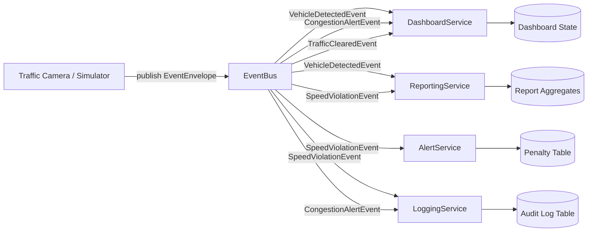

# Architecture — Event-Driven Traffic Alert System

## Architectural style
The project uses **Event-Driven Architecture**. Cameras publish events to an EventBus. Subscribers independently react to the events. This keeps cameras decoupled from the services.

## Main components

### 1. TrafficCamera / CameraSimulator
Responsible for detecting or simulating traffic incidents. It does not call `AlertService`, `LoggingService`, `DashboardService`, or `ReportingService` directly. It only creates an event and calls:

```ts
bus.publish(envelope);
```

### 2. EventBus
Responsible for:

- storing subscribers by event type;
- accepting published event envelopes;
- delivering events to all subscribers interested in the event type;
- supporting subscribe and unsubscribe;
- protecting the system with a bounded queue during high event volume.

### 3. EventEnvelope
A wrapper around every event. It contains metadata needed for audit, routing, versioning, and duplicate detection.

### 4. Subscribers
All subscribers implement the same interface:

```ts
interface IEventSubscriber<TPayload = unknown> {
  readonly name: string;
  readonly supportedEventTypes: string[];
  handle(envelope: EventEnvelope<TPayload>): Promise<void>;
}
```

Concrete subscribers:

- `AlertService`: creates penalty notices for speed violations.
- `LoggingService`: writes audit logs for important events.
- `DashboardService`: updates live dashboard state.
- `ReportingService`: aggregates historical event counts and reports.

### 5. Database
The database stores event envelopes, processed event IDs, penalties, logs, dashboard snapshots, report aggregates, and optional outbox records.

### 6. Frontend dashboard
The frontend is not part of the design-pattern marks directly, but it improves demonstration quality. It shows evidence that the backend works.

## High-level flow


## Why this architecture fits the CEP

| Assignment problem | Architecture answer |
|---|---|
| Different parts receive alerts independently | EventBus broadcasts events to multiple subscribers. |
| Adding a new feature later should not change cameras | Cameras publish generic envelopes. New subscriber can be added separately. |
| Duplicate event should not duplicate penalty | Idempotent receiver stores processed `event_id`. |
| Too many alerts arrive at once | Bounded queue and priority eviction protect memory and critical events. |
| Event format changes later | `schema_version` and optional fields support schema evolution. |
| A service fails after another service succeeds | Outbox Pattern is analyzed as the reliable alternative. |

## Runtime architecture for simple implementation
```text
Browser UI
   |
   v
React/Vite Dashboard
   |
   v
TypeScript API Server
   |-- CameraController
   |-- EventBus
   |-- Subscribers
   |-- Repositories
   v
SQLite/Prisma database
```

## Runtime architecture if deployed later
```text
Frontend: Vercel/Netlify/static host
Backend: Node.js service on Railway/Render/Fly.io
Database: PostgreSQL
Message bus upgrade path: Redis Streams / RabbitMQ / Kafka
```

For the assignment, keep the EventBus in your own code because CLO 3 is about applying design patterns, not hiding everything inside Kafka or RabbitMQ.
