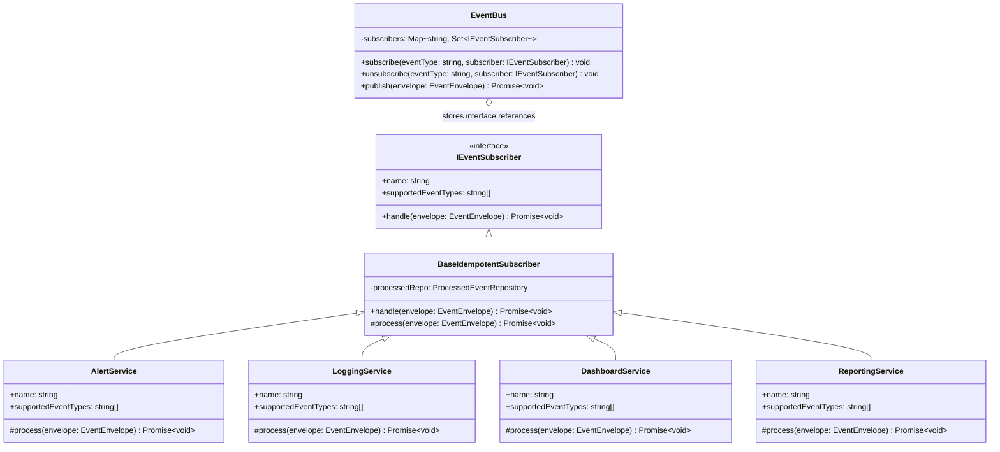

# Design Patterns Required by CEP

## 1. Event Bus

### Problem
Traffic cameras should not know which services receive events. If a camera directly calls `AlertService`, `LoggingService`, and `DashboardService`, adding a new service later forces camera-code changes.

### Solution
Use an `EventBus` between cameras and services. Cameras publish events. Subscribers register interest in event types.

### Why it fits
The EventBus supports independent receivers and allows new services to be added without changing publisher code.

### Event types — why each one exists

The CEP requires four event types. Each has a distinct domain meaning, a distinct routing target list, and a justified reason for being its own type rather than a flag on a generic event.

| Event type | Business signal | Routed to | Justification |
|---|---|---|---|
| `VehicleDetectedEvent` | A camera saw a vehicle. | Dashboard, Reporting | Baseline traffic telemetry — the "heartbeat" of the system. The Dashboard plots it on the live intersection map for operator awareness; Reporting aggregates per-camera throughput counters used for capacity planning. It carries no enforcement intent on its own, which is why neither Alert nor Logging are subscribed. |
| `SpeedViolationEvent` | Measured speed exceeded the configured limit. | Alert, Logging, Reporting | Three subscribers because each one's failure has a different consequence. **Alert** issues the penalty by looking up the user-driven `FinePolicy`; if it skips the event, a violation goes unpunished. **Logging** writes a legally defensible audit row; if it skips the event, the penalty becomes inadmissible (this is exactly the Dual Write Problem in CLO4 Scenario 3). **Reporting** maintains the per-camera fine totals used by the Analytics page. Routing it to all three is what makes the Observer Pattern earn its keep — one publish, three independent durable effects. |
| `CongestionAlertEvent` | Vehicle count at an intersection crossed the configured `congestionThreshold`. | Dashboard, Logging | Dashboard flips the intersection's status badge to amber/red so operators see the hotspot; Logging records the event so the IncidentService can group sustained congestion into a single OPEN incident. **Not** routed to Alert because congestion alone is not an enforcement action — no individual vehicle has done anything wrong yet. |
| `TrafficClearedEvent` | Vehicle count fell back below threshold for a previously congested intersection. | Dashboard | A recovery signal whose only job is to repaint the intersection card. No enforcement, no audit row needed; this is the inverse of `CongestionAlertEvent` and exists as its own type so subscribers that only care about *recovery* (the Dashboard's animation) don't have to filter every congestion event for a state change. |

**Zero-change extensibility (the rubric's full-marks clause):** All four routings are configured exclusively through `IEventSubscriber.supportedEventTypes` on each concrete subscriber. The `EventBus` itself holds a generic `Map<string, Set<IEventSubscriber>>` and never names any specific event type or subscriber class. Adding a 5th type (`EmergencyVehicleEvent`) therefore requires only declaring the payload in `EventTypes.ts` and writing a new subscriber that lists the new code in its `supportedEventTypes`. No edit to `EventBus.ts`, no edit to existing subscribers, no edit to the camera simulator — verified by `apps/api/tests/fifth-event-type.spec.ts` (3 specs).

## 2. Observer Pattern

### Problem
The bus should not depend on concrete services like `AlertService` or `DashboardService`.

### Solution
Every subscriber implements `IEventSubscriber`. The EventBus stores interface references only.

### UML class diagram


## 3. Event Envelope Pattern

### Problem
Subscribers need more than payload. They need identity, source, timestamp, version, and event type for routing, auditing, versioning, and duplicate detection.

### Solution
Wrap every event payload in `EventEnvelope`.

### Required fields
| Field | Reason |
|---|---|
| `event_id` | unique ID for duplicate detection |
| `correlation_id` | groups related events, such as one vehicle journey |
| `schema_version` | supports event format evolution |
| `source_id` | identifies the camera |
| `timestamp` | records creation time |
| `event_type` | routes event to correct subscribers |
| `payload` | contains actual event data |

## 4. Idempotent Receiver Pattern

### Problem
A network glitch can deliver the same event twice. If `AlertService` handles the same `SpeedViolationEvent` twice, the vehicle owner receives two penalties for one violation.

### Solution
Each subscriber checks whether it has already processed the `event_id`. If yes, it ignores the event. If no, it processes the event and stores the event ID.

### Proof test
```text
Given a SpeedViolationEvent envelope with event_id = X
When the same envelope is published twice
Then AlertService creates only one penalty notice
And ProcessedEvent contains one row for X + AlertService
```

## 5. Bounded Queue Tactic

### Problem
If events arrive faster than a subscriber can process them, the queue grows forever and may crash the system.

### Solution
Set a maximum queue size. When full, evict a less valuable event before adding a new event.

### Policy
Use **priority-aware eviction**:
1. Drop the least important event first.
2. If multiple events have the same priority, drop the oldest.
3. Prefer keeping `CRITICAL` congestion alerts over routine `VehicleDetectedEvent`.

## 6. Outbox Pattern

### Problem
If a camera publishes directly to the EventBus and one service fails, different services can have inconsistent results. This is related to the Dual Write Problem.

### Solution
The camera first writes the event to a local database outbox table in the same transaction as any local state change. A background publisher reads pending events and publishes them to the bus. If publishing fails, the event remains pending and can be retried.

### Tradeoff
The pattern adds complexity, a table, a background worker, retry logic, and small delay. In a traffic enforcement system, the tradeoff is worth it because penalties require a legally defensible audit trail.
