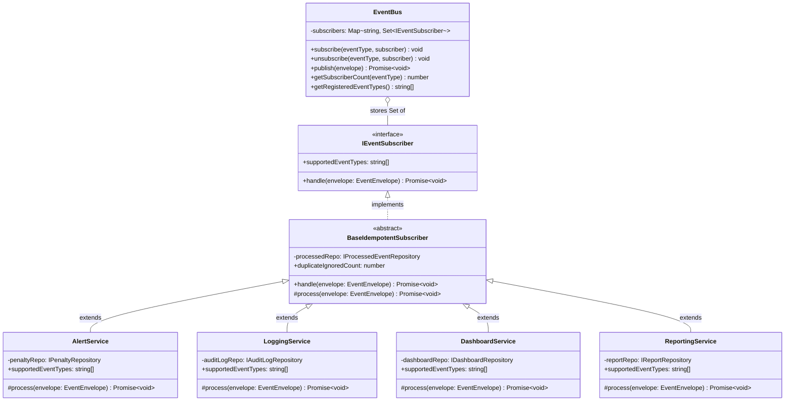

# Design Patterns — Implementation Reference

> Event-Driven Traffic Alert System · CEP Phase 8

---

## 1. Observer Pattern (CLO 3 Task 2)

### UML Class Diagram



### How It Works

The `EventBus` maintains a `Map<string, Set<IEventSubscriber>>` keyed by event type string.
Cameras call `bus.publish(envelope)`. The bus looks up the matching Set and calls
`subscriber.handle(envelope)` for each registered subscriber.

**Key viva point**: The bus stores `IEventSubscriber` interface references — not
`AlertService` or any concrete class. This means:
- Adding a 5th subscriber requires zero changes to EventBus.
- Adding a 5th event type requires zero changes to EventBus or existing subscribers.

### Subscriber Event Type Routing

| Subscriber | Subscribed to |
|---|---|
| AlertService | SpeedViolationEvent |
| LoggingService | SpeedViolationEvent, CongestionAlertEvent |
| DashboardService | VehicleDetectedEvent, CongestionAlertEvent, TrafficClearedEvent |
| ReportingService | VehicleDetectedEvent, SpeedViolationEvent |

---

## 2. Event Envelope Pattern (CLO 3 Task 3)

### The 7 Required Fields

```typescript
interface EventEnvelope<P = Record<string, unknown>> {
  event_id:       string;   // UUID v4 — uniquely identifies this event
  correlation_id: string;   // UUID v4 — groups related events
  schema_version: number;   // Defaults to 1; used for schema evolution (CLO 4 Scenario 1)
  source_id:      string;   // Camera ID that published the event
  timestamp:      string;   // ISO 8601 UTC — auto-generated
  event_type:     string;   // One of 4 defined types (or 5th for extensibility proof)
  payload:        P;        // Typed by event type; no extra fields in envelope
}
```

### createEnvelope() Factory

```typescript
// createEnvelope.ts
export function createEnvelope<P>(opts: CreateEnvelopeOptions<P>): EventEnvelope<P> {
  return {
    event_id:       opts.event_id ?? crypto.randomUUID(),
    correlation_id: opts.correlation_id ?? crypto.randomUUID(),
    schema_version: opts.schema_version ?? 1,
    source_id:      opts.source_id,
    timestamp:      new Date().toISOString(),
    event_type:     opts.event_type,
    payload:        opts.payload,
  };
}
```

**Key viva point**: Priority is NOT an 8th field. The `BoundedEventQueue` derives priority
from `event_type` externally via `getEventPriority()`. The envelope remains a pure 7-field
data carrier.

---

## 3. Idempotent Receiver Pattern (CLO 3 Task 4)

### Template Method in BaseIdempotentSubscriber

```typescript
// BaseIdempotentSubscriber.ts
abstract class BaseIdempotentSubscriber implements IEventSubscriber {
  async handle(envelope: EventEnvelope): Promise<void> {
    // Step 1: Gate — check if already processed
    const alreadyProcessed = await this.processedRepo.exists(
      envelope.event_id,
      this.name
    );

    if (alreadyProcessed) {
      this.duplicateIgnoredCount++;
      return; // ← second attempt silently stopped here
    }

    // Step 2: Process (abstract — implemented by each service)
    await this.process(envelope);

    // Step 3: Mark as processed (per event + per subscriber)
    await this.processedRepo.markProcessed(envelope.event_id, this.name);
  }

  protected abstract process(envelope: EventEnvelope): Promise<void>;
}
```

### Double Safety Net

| Layer | Mechanism | What It Prevents |
|---|---|---|
| Application | `BaseIdempotentSubscriber.handle()` check | Duplicate `process()` call in memory |
| Database | `ProcessedEvent @@unique([eventId, subscriberName])` | Duplicate insert in DB |
| Database | `Penalty @unique(eventId)` | Duplicate penalty even if app layer fails |

---

## 4. Bounded Queue Tactic (CLO 4 Scenario 2)

### Priority-Aware Eviction

```typescript
// BoundedEventQueue.ts
export const EVENT_PRIORITY = {
  CongestionAlertEvent:  4, // CRITICAL — preserve at all costs
  SpeedViolationEvent:   3, // HIGH
  TrafficClearedEvent:   2, // MEDIUM
  VehicleDetectedEvent:  1, // LOW — evict first
};
```

### Eviction Decision Logic

```
Is queue full?
  NO  → enqueue immediately
  YES → find eviction candidate (lowest priority; oldest if tied)
        incoming.priority < candidate.priority?
          YES → discard incoming (it is less important than everything in queue)
          NO  → evict candidate, enqueue incoming
```

### Capacity Calculation

```
backlog growth  = incomingRate − processingRate = 500 − 80 = 420 events/sec
secondsUntilFull = queueLimit / backlogGrowth = 10,000 / 420 ≈ 23.81 seconds
```

---

## 5. Outbox Pattern (CLO 4 Scenario 3 — Prototype)

### Problem it Solves

When `AlertService` creates a penalty and `LoggingService` must write an audit log,
both are triggered by the same event. If the system crashes between them, one succeeds
and one fails — the **Dual Write Problem**.

### Solution: Write Event to Local DB First

```
TRANSACTION {
  INSERT business record (e.g., penalty)
  INSERT EventOutbox(status=PENDING, payload=envelope)
}

BACKGROUND RELAY {
  SELECT * FROM EventOutbox WHERE status = PENDING
  → Publish to EventBus
  → UPDATE EventOutbox SET status = PUBLISHED
  → On failure: retry (row stays PENDING)
}
```

The `EventOutbox` model and `OutboxRepository` are implemented. Relay logic is documented
in `docs/07_CLO4_ANALYSIS_ADR.md` Scenario 3.
