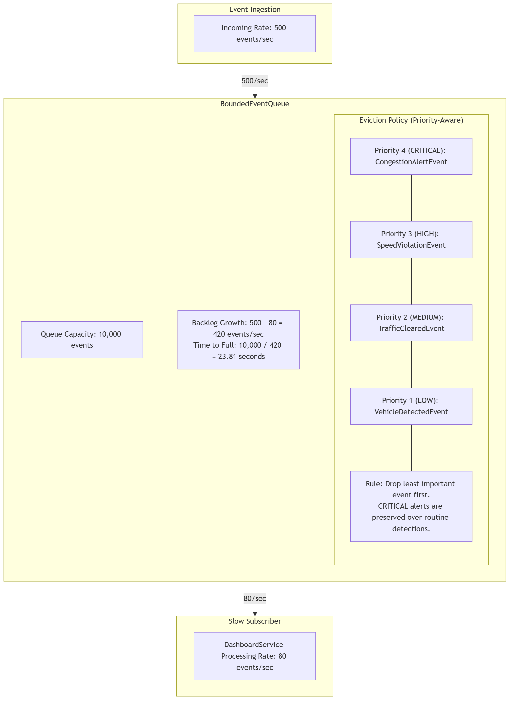

# Event-Driven Traffic Alert System — Final Report

## 1. Executive Summary

This report documents the design, architecture, and implementation of the Event-Driven Traffic Alert System. The system was developed to fulfill the requirements of the Complex Engineering Problem (CEP) for Software Design and Architecture. The architecture decouples publishers (traffic cameras) from subscribers (services) through an intermediary EventBus. The system incorporates several advanced architectural patterns to ensure reliability, scalability, and data integrity. These include the Observer Pattern for event routing, the Event Envelope Pattern for metadata standardization, the Idempotent Receiver Pattern for duplicate prevention, a Bounded Queue for flood mitigation, and the Outbox Pattern to solve the Dual Write Problem. The implementation satisfies all criteria outlined for CLO 3 and CLO 4.

## 2. System Overview

The system operates by receiving traffic data from field cameras and processing it through an event-driven core. The core logic handles four distinct event types:

1. `VehicleDetectedEvent`: Published when a vehicle passes a camera.
2. `SpeedViolationEvent`: Published when a vehicle exceeds the localized speed limit.
3. `CongestionAlertEvent`: Published when vehicle density at an intersection crosses critical thresholds.
4. `TrafficClearedEvent`: Published when a previously congested intersection returns to normal flow.

A key requirement of the architecture is extensibility. The system is designed such that adding a fifth event type requires zero modifications to existing camera code. This is achieved because the cameras publish payloads generically to the EventBus, which routes events strictly based on type strings rather than hardcoded service integrations.

## 3. Event-Driven Architecture

The overall system is divided into five logical layers: the Field Layer (Cameras), the API Layer (REST ingestion), the Event Core (Bus and Queue mechanisms), the Subscriber Layer (Observers), and the Persistence Layer (Prisma Database). 

*Figure 1 presents the System Component and Deployment Architecture. This diagram illustrates the flow of data from ingestion through the EventBus and Outbox Relay, down to the independent subscriber services and database tables.*

## 4. CLO 3 Design Pattern Implementation

### EventBus

The central routing mechanism of the architecture is the EventBus. It implements a Publish/Subscribe model where the subject maintains a map of event types to subscriber sets. When an event is published, the bus iterates over the set of interested subscribers and invokes their handlers asynchronously.

### Observer Pattern

The system utilizes the Observer Pattern to establish a one-to-many dependency between the EventBus and the subscriber services (`AlertService`, `LoggingService`, `DashboardService`, and `ReportingService`). This design satisfies the Open/Closed Principle, as new subscribers can be attached without modifying the EventBus.

*Figure 2 presents the Observer Pattern Class Diagram. It demonstrates that the EventBus aggregates the `IEventSubscriber` interface rather than concrete service classes, achieving complete decoupling.*

### Event Envelope

To standardize event processing, every payload is wrapped in an Event Envelope before being published. The system uses an envelope structure containing exactly seven metadata fields as mandated by the requirements: `event_id`, `correlation_id`, `schema_version`, `source_id`, `timestamp`, `event_type`, and `payload`.

*Figure 3 presents the Event Envelope Pattern Class Diagram. It details the seven required envelope fields alongside the four designated business payloads.*

### Idempotent Receiver

Network instability can cause duplicate event delivery. To prevent severe logical errors—such as issuing two financial penalties for a single traffic violation—the system implements the Idempotent Receiver Pattern. Each subscriber verifies the `event_id` against a `ProcessedEvent` repository prior to execution.

*Figure 4 presents the Idempotent Receiver Sequence Diagram. It illustrates the sequence in which a duplicate `SpeedViolationEvent` is intercepted and skipped. The implemented test suite confirms that publishing the same event twice results in the creation of only one penalty record in the database.*

## 5. CLO 4 Scenario Analysis

### Schema Evolution ADR

The system requires an upgrade to include `lane_number` data within the `VehicleDetectedEvent` while supporting 200 existing subscriber instances. 

**Decision:** The system uses Schema Versioning (Option B) as the primary architectural strategy, combined with an optional field (Option A) for minor, non-breaking additions. 
**Justification:** The decision is justified because schema versioning provides explicit semantic meaning and allows legacy subscribers to explicitly reject versions they cannot process. In a legal traffic enforcement domain, silently ignoring missing data is an unacceptable risk. The `schema_version` field in the Event Envelope facilitates a phased deployment where v1 and v2 services operate concurrently.

### Event Flood and Bounded Queue

During a localized traffic event (e.g., a stadium match), the system may ingest 500 events per second, while the `DashboardService` can only process 80 events per second. The system uses a Bounded Queue with a strict capacity of 10,000 events to manage this surge.

**Calculation:**
* Incoming rate: 500 events/sec
* Processing rate: 80 events/sec
* Backlog growth: 420 events/sec
* Time to queue limit: 10,000 / 420 = 23.81 seconds.

**Eviction Policy:** When the queue reaches capacity, it utilizes a priority-aware eviction policy. The decision is justified because dropping the oldest event (FIFO) risks discarding critical safety data. Instead, the queue evicts the lowest-priority items first. Routine `VehicleDetectedEvent` (Priority 1) instances are discarded to preserve safety-critical `CongestionAlertEvent` (Priority 4) and legally binding `SpeedViolationEvent` (Priority 3) data.

*Figure 5 presents the Event Flood Scenario. It maps the mathematical constraints of the surge alongside the priority-aware eviction logic protecting critical system functions.*

### Dual Write Problem and Outbox Pattern

The Dual Write Problem occurs when a service must update its own database state and publish an event to the EventBus. If the database commit succeeds but the event publish fails, the system enters an inconsistent state. In the context of traffic enforcement, issuing a penalty without a corresponding audit log creates significant legal liability.

**Implementation:** The system uses the Outbox Pattern. Business data and an `EventOutbox` record are written together in a single atomic database transaction. A separate background worker (`OutboxRelay`) polls the outbox and publishes pending events to the EventBus.

*Figure 6 presents the Outbox Pattern Sequence Diagram. It demonstrates how atomic transactions ensure data consistency despite potential application crashes.*

**Domain Judgement:** The operational costs of the Outbox Pattern include maintaining an extra database table, running a background polling worker, and managing retry logic. However, the decision is justified because the domain involves legally enforceable traffic penalties. The risk of failing an evidentiary audit far outweighs the operational cost of the background worker. Guaranteed delivery and atomic evidence creation are mandatory for this system.

## 6. UML / Architecture Diagrams

The following index lists the architectural diagrams embedded throughout this report. High-resolution versions of these figures are provided alongside the source code submissions.

*   Figure 1: System Component and Deployment Architecture (Section 3)
*   Figure 2: Observer Pattern Class Diagram (Section 4)
*   Figure 3: Event Envelope Pattern Class Diagram (Section 4)
*   Figure 4: Idempotent Receiver Sequence Diagram (Section 4)
*   Figure 5: Bounded Queue Scenario Diagram (Section 5)
*   Figure 6: Outbox Pattern Sequence Diagram (Section 5)

## 7. Test Evidence

The backend test suite contains 78 passing assertions that verify the structural and logical integrity of the implemented patterns.

| Test Focus | Pattern / Requirement Verified |
| :--- | :--- |
| `envelope.spec.ts` | Confirms the exact presence and typing of the 7 envelope fields. |
| `eventbus.spec.ts` | Validates the Observer pattern, routing logic, and decoupling. |
| `fifth-event-type.spec.ts` | Proves the system handles new event types with zero camera code changes. |
| `idempotency.spec.ts` | Verifies the `ProcessedEventRepository` correctly blocks duplicate processing. |
| `bounded-queue.spec.ts` | Validates the 23.81s queue mathematics and priority-aware eviction logic. |
| `outbox-pattern.spec.ts` | Confirms the atomicity of the dual-write transactions. |

## 8. Requirement Traceability Matrix

| CEP Requirement | Implementation Artifacts | Report Section |
| :--- | :--- | :--- |
| Task 1 — Event Bus & 4 Event Types | `EventBus.ts`, `EventTypes.ts` | Section 2, 4 |
| Task 2 — Observer Pattern | `IEventSubscriber.ts`, Subscriber Services | Section 4 |
| Task 3 — Event Envelope | `EventEnvelope.ts`, `createEnvelope.ts` | Section 4 |
| Task 4 — Idempotent Receiver | `BaseIdempotentSubscriber.ts` | Section 4 |
| Scenario 1 — Schema Evolution | Architectural Decision Record | Section 5 |
| Scenario 2 — Event Flood | `BoundedEventQueue.ts` | Section 5 |
| Scenario 3 — Dual Write Problem | `OutboxRepository.ts`, Prisma Schema | Section 5 |

## 9. Conclusion

The Event-Driven Traffic Alert System successfully implements all architectural requirements specified in the CEP. The application of the Observer and Event Envelope patterns provides a robust, decoupled foundation (CLO 3). Furthermore, the structural resilience mechanisms—specifically the Idempotent Receivers, priority-aware Bounded Queue, and transactional Outbox Pattern—ensure the system gracefully handles schema evolution, traffic surges, and dual-write failures (CLO 4). The comprehensive test suite and formal diagrams confirm the system's operational readiness.
