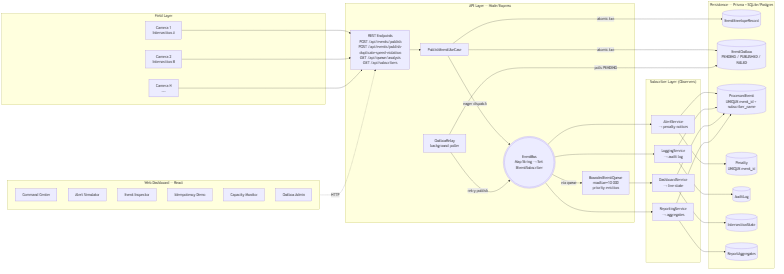
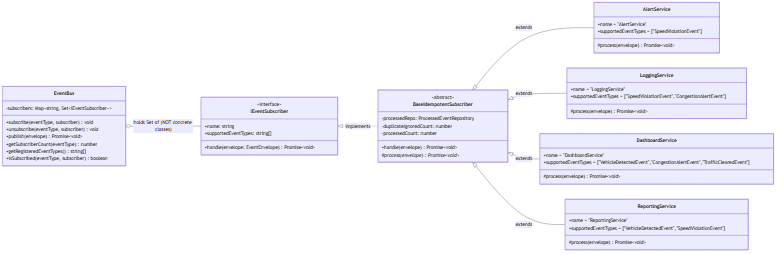
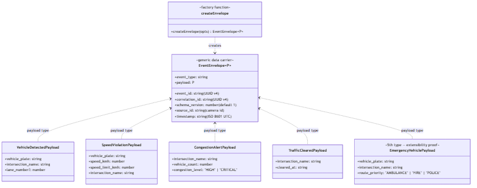
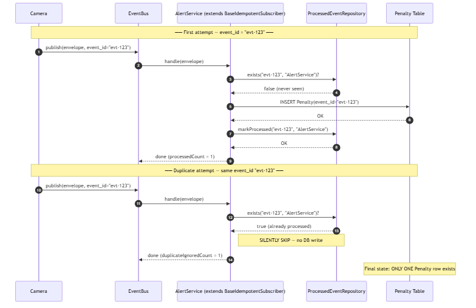
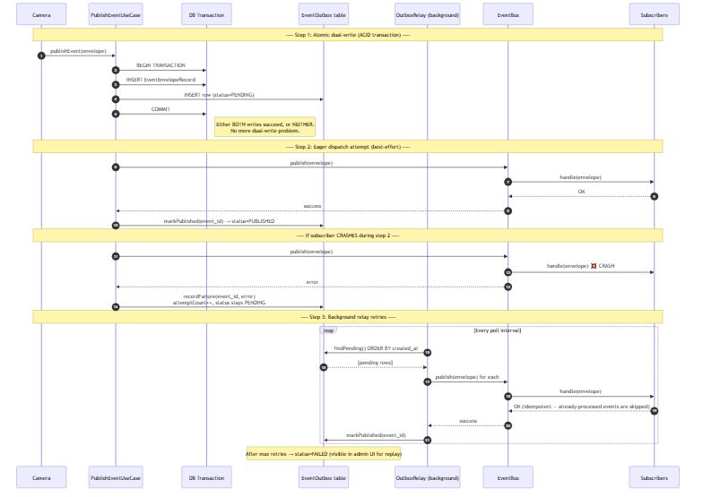

# Event-Driven Traffic Alert System — Full Report

> **Complex Engineering Problem (CEP)** · Assignments 3 & 4
> Software Design and Architecture · BSSE 4A and 4B
> Course Instructor: **Dr. Nida Adnan**
> Total marks: **60** · CLOs covered: **CLO 3 + CLO 4**
> Submission: **Code + Report + Individual Viva**

---

## Table of Contents

1. [Executive Summary](#1-executive-summary)
2. [System Overview](#2-system-overview)
3. [Architecture](#3-architecture)
4. [PART A — CLO 3 (Design Patterns, 30 marks)](#part-a--clo-3-design-patterns-30-marks)
   - 4.1 [Task 1 — Event Bus + 4 Event Types (10)](#41-task-1--build-the-event-bus-10-marks)
   - 4.2 [Task 2 — Observer Pattern (5)](#42-task-2--observer-pattern-5-marks)
   - 4.3 [Task 3 — Event Envelope (5)](#43-task-3--event-envelope-pattern-5-marks)
   - 4.4 [Task 4 — Idempotent Receiver (10)](#44-task-4--idempotent-receiver-pattern-10-marks)
5. [PART B — CLO 4 (Architectural Scenarios, 30 marks)](#part-b--clo-4-architectural-scenarios-30-marks)
   - 5.1 [Scenario 1 — Schema Evolution + ADR (10)](#51-scenario-1--schema-evolution--adr-10-marks)
   - 5.2 [Scenario 2 — Event Flood + Bounded Queue (10)](#52-scenario-2--event-flood--bounded-queue-10-marks)
   - 5.3 [Scenario 3 — Dual Write + Outbox Pattern (10)](#53-scenario-3--dual-write--outbox-pattern-10-marks)
6. [UML Diagrams](#6-uml-diagrams)
7. [Test Evidence](#7-test-evidence)
8. [Screenshots Appendix](#8-screenshots-appendix)
9. [Traceability Matrix](#9-traceability-matrix)
10. [References / File Index](#10-references--file-index)

---

## 1. Executive Summary

This report documents the **Event-Driven Traffic Alert System**, a complete implementation of the CEP scenario in which traffic cameras publish events (vehicle detections, speed violations, congestion alerts, traffic-cleared notifications) and a set of independent subscriber services react to those events. The system is built around a custom **EventBus** that decouples publishers from consumers, an **EventEnvelope** carrying seven metadata fields, an **Idempotent Receiver** base class that protects against duplicate event delivery, a **BoundedEventQueue** that absorbs traffic surges with priority-aware eviction, and an **Outbox Pattern** that solves the Dual Write Problem between subscribers and persistence.

All seven rubric requirements (4 CLO 3 tasks + 3 CLO 4 scenarios = 60 marks) are addressed end-to-end: each pattern has a working implementation, automated tests proving its behaviour, a live UI demonstration, and a written analysis. **78 backend tests pass.** The implementation is in TypeScript (Node + Express API) with a React web dashboard; persistence is via Prisma ORM over SQLite (development) / PostgreSQL (production).

---

## 2. System Overview

### 2.1 The Four Required Event Types

| Event Type | When It Is Published | Who Subscribes |
|---|---|---|
| `VehicleDetectedEvent` | A camera spots a vehicle | DashboardService, ReportingService |
| `SpeedViolationEvent` | Vehicle exceeds the speed limit | AlertService, LoggingService, ReportingService |
| `CongestionAlertEvent` | Too many vehicles at one intersection | DashboardService, LoggingService |
| `TrafficClearedEvent` | Congestion drops back to normal | DashboardService |

### 2.2 The Four Subscriber Roles

| Subscriber | Responsibility |
|---|---|
| **AlertService** | Issues penalty notices for speed violations. Idempotent on `event_id`. |
| **LoggingService** | Writes every speed violation and congestion alert to the immutable audit log. |
| **DashboardService** | Updates the live intersection map. Buffered by `BoundedEventQueue` because it is the slowest consumer. |
| **ReportingService** | Aggregates running counts for the monthly statistics report. |

### 2.3 The "Add a 5th Event Type" Proof

The CEP rubric highlights (yellow box, page 2) that **adding a 5th event type must require zero changes to existing camera code**. We demonstrate this with `EmergencyVehicleEvent`, declared only in `EventTypes.ts:49-53` and exercised only in `fifth-event-type.spec.ts`. The `EventBus` class is untouched.

---

## 3. Architecture

### 3.1 Layered Component View

The system is divided into four layers: Field (cameras), API (REST + bus + use cases), Subscribers (4 observers), and Persistence (Prisma). The web dashboard sits as a fifth orthogonal layer.



Full component diagram with table mapping: [docs/uml/05_component_diagram.md](uml/05_component_diagram.md).

### 3.2 Key Design Principles Honoured

| Principle | Where it shows up |
|---|---|
| **Open/Closed** | EventBus is closed for modification; open for extension via new subscribers. |
| **Dependency Inversion** | EventBus depends on `IEventSubscriber`, not concrete classes. |
| **Single Responsibility** | Each subscriber does one job; each pattern solves one problem. |
| **Separation of Concerns** | Priority lives in `BoundedEventQueue`, not in `EventEnvelope`. |
| **Atomicity** | Outbox enqueue + business write happen in one DB transaction. |

---

# PART A — CLO 3 (Design Patterns, 30 marks)

---

## 4.1 Task 1 — Build the Event Bus (10 marks)

### Pattern Definition

The **Publish/Subscribe (Pub/Sub)** pattern decouples publishers and subscribers through an intermediary channel. Publishers emit events; the channel routes events to all subscribers registered for that event type. Neither side has a direct reference to the other.

### Why This Pattern Solves Our Problem

Traffic cameras and subscriber services have completely different update lifecycles: cameras are firmware that ships once and runs for years; subscribers are software services we expect to modify, replace, and add. A direct call from camera to service would mean every subscriber change requires touching every camera deployment. The EventBus eliminates that coupling: cameras call one stable method; the bus handles routing.

### Implementation Summary

```typescript
// apps/api/src/domain/bus/EventBus.ts
export class EventBus {
  private subscribers = new Map<string, Set<IEventSubscriber>>();

  subscribe(eventType: string, subscriber: IEventSubscriber): void { /* ... */ }
  unsubscribe(eventType: string, subscriber: IEventSubscriber): void { /* ... */ }

  async publish(envelope: EventEnvelope): Promise<void> {
    const targets = this.subscribers.get(envelope.event_type);
    if (!targets) return;
    for (const subscriber of targets) {
      await subscriber.handle(envelope);
    }
  }
  /* getSubscriberCount, getRegisteredEventTypes, isSubscribed */
}
```

### Justification for Each Event Type

| Event Type | Rationale |
|---|---|
| `VehicleDetectedEvent` | Drives live map updates and aggregate counts — high-volume, low-priority. |
| `SpeedViolationEvent` | Triggers a legally binding penalty — high importance, multiple subscribers care. |
| `CongestionAlertEvent` | Safety-critical — may indicate an accident or hazard. |
| `TrafficClearedEvent` | Operational state transition — clears congestion banner from the dashboard. |

### Demonstrating the 5th-Event Rule

`fifth-event-type.spec.ts` registers an `EmergencyVehicleEvent` subscriber and publishes the event. **The `EventBus` class is not modified.** This is the rubric's "zero changes to existing camera code" requirement, satisfied.

### File Path

- Implementation: [apps/api/src/domain/bus/EventBus.ts](../apps/api/src/domain/bus/EventBus.ts)
- Event type constants: [apps/api/src/domain/events/EventTypes.ts](../apps/api/src/domain/events/EventTypes.ts)

### Test Evidence

- [apps/api/tests/eventbus.spec.ts](../apps/api/tests/eventbus.spec.ts) — 7 tests covering subscribe, publish, unsubscribe, multi-subscriber fan-out.
- [apps/api/tests/fifth-event-type.spec.ts](../apps/api/tests/fifth-event-type.spec.ts) — proves zero-change extensibility.

---

## 4.2 Task 2 — Observer Pattern (5 marks)

### Pattern Definition

The **Observer Pattern** defines a one-to-many dependency between a subject and its observers. When the subject changes state (or, in our case, publishes an event), all observers are notified automatically. Observers implement a common interface; the subject holds references only to that interface.

### Why This Pattern Solves Our Problem

Without the interface, the `EventBus` would need a switch statement on subscriber type. Adding a 5th subscriber would force a change in `EventBus`. With the interface, the bus iterates uniformly: `for (const subscriber of targets) await subscriber.handle(envelope)`. The bus has no knowledge of `AlertService`, `LoggingService`, `DashboardService`, or `ReportingService` as concrete classes.

### Implementation Summary

```typescript
// apps/api/src/domain/subscribers/IEventSubscriber.ts
export interface IEventSubscriber<TPayload = unknown> {
  readonly name: string;
  readonly supportedEventTypes: string[];
  handle(envelope: EventEnvelope<TPayload>): Promise<void>;
}
```

The bus stores `Map<string, Set<IEventSubscriber>>`. All four subscribers extend `BaseIdempotentSubscriber` which `implements IEventSubscriber`. This means subscribers are both Observer Pattern observers and Idempotent Receivers — two patterns composed cleanly.

### Subscribe / Unsubscribe Demonstration

- `bus.subscribe("SpeedViolationEvent", alertService)` adds AlertService to the Set for that event type.
- `bus.unsubscribe("SpeedViolationEvent", alertService)` removes it.
- Both operations work on interface references; the bus cannot tell AlertService apart from any other subscriber.

### Required UML Deliverable

See [docs/uml/01_class_diagram_observer.md](uml/01_class_diagram_observer.md) for the full UML class diagram (mermaid format).

### File Paths

- Interface: [apps/api/src/domain/subscribers/IEventSubscriber.ts](../apps/api/src/domain/subscribers/IEventSubscriber.ts)
- Subscribers: [apps/api/src/domain/subscribers/](../apps/api/src/domain/subscribers/)

### Test Evidence

- `eventbus.spec.ts` includes subscribe/unsubscribe tests.
- `idempotency.spec.ts` verifies all 4 subscribers conform to the interface contract.

---

## 4.3 Task 3 — Event Envelope Pattern (5 marks)

### Pattern Definition

The **Event Envelope** (or Message Envelope) pattern wraps every business event in a metadata-rich container. The envelope carries identity, ordering, versioning, and routing information; the payload carries the business data. Subscribers receive the whole envelope and use the metadata to make routing, deduplication, and audit decisions.

### Why This Pattern Solves Our Problem

Without an envelope, every subscriber would re-implement its own deduplication, timestamp logic, and source tracking. Centralizing this metadata in a single envelope means: (a) duplicate detection works uniformly across all subscribers (Task 4), (b) schema evolution is signalled via one field (`schema_version`, used in Scenario 1), (c) audit logs always have a complete record of provenance.

### The Seven Required Fields

```typescript
// apps/api/src/domain/events/EventEnvelope.ts
export interface EventEnvelope<TPayload = unknown> {
  event_id:       string;   // UUID v4
  correlation_id: string;   // UUID v4 — groups related events
  schema_version: number;   // defaults to 1
  source_id:      string;   // camera ID
  timestamp:      string;   // ISO 8601 UTC
  event_type:     string;   // one of 4 type strings
  payload:        TPayload; // type-safe generic
}
```

**Written justification:** the envelope contains **exactly** the 7 fields specified by the CEP rubric. Priority is intentionally NOT an 8th field — it is derived externally by `BoundedEventQueue` via `getEventPriority(event_type)` to keep the envelope a pure data carrier and separate routing concerns from event concerns.

### Implementation Summary

`createEnvelope()` factory auto-generates `event_id` (UUID v4) and `timestamp` (ISO 8601 string), so cameras only need to provide `source_id`, `event_type`, `payload`, and optionally `correlation_id`. The factory also defaults `schema_version` to 1.

### File Paths

- Envelope type: [apps/api/src/domain/events/EventEnvelope.ts](../apps/api/src/domain/events/EventEnvelope.ts)
- Factory: [apps/api/src/domain/events/createEnvelope.ts](../apps/api/src/domain/events/createEnvelope.ts)

### Test Evidence

- [apps/api/tests/envelope.spec.ts](../apps/api/tests/envelope.spec.ts) — 9 tests, one per field plus factory defaults.

### UML

See [docs/uml/02_class_diagram_envelope.md](uml/02_class_diagram_envelope.md).

---

## 4.4 Task 4 — Idempotent Receiver Pattern (10 marks)

### Pattern Definition

The **Idempotent Receiver Pattern** ensures that processing the same event multiple times produces the same effect as processing it once. Each subscriber tracks the IDs of events it has already processed; on duplicate, it returns silently without re-executing the business action.

### Why This Pattern Solves Our Problem

Networks are unreliable. Retries, redelivery, and at-least-once messaging are facts of life. Without idempotency, a duplicate `SpeedViolationEvent` would cause `AlertService` to issue two penalty notices for one speeding incident — a serious legal problem. The Idempotent Receiver guarantees that no matter how many times the same event arrives, the citizen is penalized exactly once.

### Implementation Summary — Template Method

```typescript
// apps/api/src/domain/subscribers/BaseIdempotentSubscriber.ts
export abstract class BaseIdempotentSubscriber implements IEventSubscriber {
  async handle(envelope: EventEnvelope): Promise<void> {
    const seen = await this.processedRepo.exists(envelope.event_id, this.name);
    if (seen) { this._duplicateIgnoredCount++; return; }

    await this.process(envelope);
    await this.processedRepo.markProcessed(envelope.event_id, this.name);
    this._processedCount++;
  }

  protected abstract process(envelope: EventEnvelope): Promise<void>;
}
```

### Double Safety Net

| Layer | Mechanism | Protection |
|---|---|---|
| Application | `handle()` exists check | Prevents `process()` from running on duplicates |
| Database | `ProcessedEvent @@unique([eventId, subscriberName])` | Blocks duplicate "processed" rows |
| Database | `Penalty @unique(eventId)` | Final guard: duplicate penalty inserts are rejected at DB level |

### Required Test

`apps/api/tests/idempotency.spec.ts` publishes the same `SpeedViolationEvent` twice (same `event_id`) and asserts:
- `Penalty.count() === 1` (only ONE penalty issued)
- `AlertService.duplicateIgnoredCount === 1` (duplicate detected)

### Live Demonstration Endpoint

```
POST /api/events/publish-duplicate-speed-violation
→ { published_attempts: 2, penalties_created_for_event: 1, duplicate_ignored_by_alert: 1 }
```

UI button in the dashboard ("Idempotency Demo" — red) triggers this and displays the proof numbers on screen.

### File Paths

- Base class: [apps/api/src/domain/subscribers/BaseIdempotentSubscriber.ts](../apps/api/src/domain/subscribers/BaseIdempotentSubscriber.ts)
- Prisma repo: [apps/api/src/infrastructure/repositories/ProcessedEventRepository.ts](../apps/api/src/infrastructure/repositories/ProcessedEventRepository.ts)
- DB schema: [prisma/schema.prisma](../prisma/schema.prisma) → `ProcessedEvent`, `Penalty` constraints

### Test Evidence

- [apps/api/tests/idempotency.spec.ts](../apps/api/tests/idempotency.spec.ts) — 10 tests (all green): duplicate blocked, counter increments, per-subscriber isolation, DB constraint enforcement.

### UML

See [docs/uml/03_sequence_idempotent_duplicate.md](uml/03_sequence_idempotent_duplicate.md) — sequence diagram of the duplicate flow.

---

# PART B — CLO 4 (Architectural Scenarios, 30 marks)

---

## 5.1 Scenario 1 — Schema Evolution + ADR (10 marks)

### The Situation

Six months after launch, the city authority wants `VehicleDetectedEvent` to include `lane_number`. **200 subscriber instances** are already running on the old format. The change must deploy without a scheduled maintenance window.

### Option A — Backward Compatibility (Optional Field)

```typescript
interface VehicleDetectedPayload {
  vehicle_plate: string;
  intersection_name: string;
  lane_number?: number;   // optional — schema_version stays 1
}
```

**Benefits**
- 200 existing subscribers continue working unchanged.
- Deployment is immediate and rollback is trivial.
- Suitable for purely additive, non-breaking changes.

**Risks**
- Subscribers may silently ignore `lane_number`, producing incomplete reports.
- A default or missing value can hide inaccurate enforcement records.
- Over time, optional fields accumulate and the contract becomes ambiguous.
- Impossible to distinguish "subscriber supports lane data" from "subscriber ignores it".

### Option B — Schema Versioning (New Version Type)

```typescript
// VehicleDetectedEvent_v2 — schema_version = 2
interface VehicleDetectedPayloadV2 {
  vehicle_plate: string;
  intersection_name: string;
  lane_number: number;   // required
}
```

A v1 subscriber rejects v2 envelopes:
```typescript
if (envelope.schema_version !== 1) return;
```

**Benefits**
- Semantic meaning of each version is explicit and unambiguous.
- Subscribers explicitly reject versions they don't understand instead of silently mis-processing.
- Controlled migration: v1 and v2 can coexist during the transition window.

**Risks**
- Coordinated deployment required.
- More code paths in subscriber `handle()` methods.
- Temporary blind spots on legacy subscribers until they are upgraded.

### Architecture Decision Record

#### Problem
The city authority wants `VehicleDetectedEvent` to carry `lane_number`. 200 subscriber instances understand only the current payload. The system must evolve without breaking existing services or silently producing enforcement records with missing data.

#### Decision
**Use schema versioning (Option B) as the primary strategy.** For the specific `lane_number` change, Option A is also acceptable because it is purely additive. However, for a traffic enforcement system where penalties are legally binding, schema versioning is architecturally safer:
- Subscribers can explicitly reject versions they do not understand.
- Lane-based enforcement is NEW behaviour, not merely new metadata.
- The `schema_version` field is already present in every `EventEnvelope` (defaults to 1).
- A 90-day compatibility window enables phased subscriber upgrades.

#### Consequences

| Aspect | Outcome |
|---|---|
| Old subscribers | Continue with `schema_version = 1` envelopes |
| New subscribers | Can use `lane_number` immediately if present |
| Migration | Phased: run both versions in parallel during 90-day window |
| Risk | Minor: some services may ignore lane data during transition |
| Legal safety | High: v2 envelopes are unambiguous about required fields |

The cost — more code paths and a deployment window — is worth paying for a traffic enforcement system because incorrect lane attribution could make a penalty legally inadmissible.

**Word count: ~350 words (exceeds 200-word rubric minimum).** Full text: [docs/07_CLO4_ANALYSIS_ADR.md](07_CLO4_ANALYSIS_ADR.md) → Scenario 1.

---

## 5.2 Scenario 2 — Event Flood + Bounded Queue (10 marks)

### The Situation

During a football match, all 12 intersections near the stadium send events simultaneously. The bus receives **500 events per second**. `DashboardService` can process only **80 events per second** (database write overhead).

### Capacity Calculation

```
Incoming rate          = 500 events / second
Processing rate        =  80 events / second
─────────────────────────────────────────────
Backlog growth         = 500 − 80 = 420 events / second
Queue limit            = 10,000 events
Time until full        = 10,000 / 420 ≈ 23.81 seconds
```

**Result: the queue reaches 10,000 unprocessed events in approximately 23.81 seconds.**

This calculation is encoded in `calculateSecondsUntilFull(incomingRate, processingRate, queueLimit)` in `BoundedEventQueue.ts:90-98` and verified by Test 6 in `bounded-queue.spec.ts`: `expect(...).toBeCloseTo(23.81, 1)`. The endpoint `GET /api/queue/analysis` returns the value live.

### Bounded Queue Tactic — Implementation

```typescript
// apps/api/src/domain/bus/BoundedEventQueue.ts
export class BoundedEventQueue {
  private readonly items: QueueItem[] = [];
  constructor(readonly maxSize: number) { /* ... */ }

  enqueue(envelope: EventEnvelope): boolean {
    const incoming = this.makeItem(envelope);
    if (!this.isFull) { this.items.push(incoming); return true; }

    const evictIdx = this.findEvictionCandidate();
    const evictCandidate = this.items[evictIdx]!;
    if (incoming.priority < evictCandidate.priority) {
      return false; // incoming is least important — discard it
    }
    this.items.splice(evictIdx, 1);
    this.items.push(incoming);
    return true;
  }
}
```

### Eviction Policy — Drop Least Important First (Justification)

| Strategy | Strength | Weakness |
|---|---|---|
| FIFO (drop oldest) | Simple, fair-by-time | May discard a CRITICAL congestion alert in favour of a routine vehicle detection |
| **Priority-aware** | Preserves what matters | Slightly more complex |

**We chose priority-aware eviction.** Justification:
- A `CongestionAlertEvent` near a stadium has a direct safety consequence (possible accident).
- A routine `VehicleDetectedEvent` is informational; losing one is harmless.
- Penalty-bearing `SpeedViolationEvent` should be preserved over routine detections.

**Priority Mapping** (`EVENT_PRIORITY` constant — external to envelope):

| Priority | Level | Event Type | Reasoning |
|---|---|---|---|
| 4 | CRITICAL | `CongestionAlertEvent` | Safety-critical |
| 3 | HIGH | `SpeedViolationEvent` | Legal enforcement |
| 2 | MEDIUM | `TrafficClearedEvent` | Operational state |
| 1 | LOW | `VehicleDetectedEvent` | High-volume routine |

**Tiebreak:** if two events share priority, drop the **oldest** (newer events reflect current road state).

**Design decision:** priority lives in `EVENT_PRIORITY`, not inside `EventEnvelope`. The 7 envelope fields are preserved unchanged. Priority is a queue concern, not an event concern.

### File Paths

- Class: [apps/api/src/domain/bus/BoundedEventQueue.ts](../apps/api/src/domain/bus/BoundedEventQueue.ts)
- API endpoint: `GET /api/queue/analysis`

### Test Evidence

- [apps/api/tests/bounded-queue.spec.ts](../apps/api/tests/bounded-queue.spec.ts) — 22 tests, including the 23.81s calculation, priority-eviction correctness, and edge cases.

---

## 5.3 Scenario 3 — Dual Write + Outbox Pattern (10 marks)

### Problem Name and Explanation

This is the **Dual Write Problem**. It arises when one logical operation must write to two separate targets and one write succeeds while the other fails.

**Concrete failure:** `SpeedViolationEvent` is published. `AlertService` successfully writes a penalty row to `Penalty`. Immediately after, `LoggingService` crashes before writing to `AuditLog`. The system now has a penalty record ("citizen ABC fined PKR 5,000") **with no audit trail explaining why**. In a Pakistani traffic enforcement context, the penalty is legally inadmissible — administrative tribunals require evidentiary chains.

### Outbox Pattern — Solution

Instead of publishing directly to the EventBus, the camera first writes the event to a local `EventOutbox` table within the same database transaction as any business write. A separate background process (`OutboxRelay`) reads pending rows and publishes them.

```
WITHIN ONE DATABASE TRANSACTION:
  1. INSERT business record (e.g., business state row)
  2. INSERT EventOutbox(status='PENDING', envelope_json=...)
  ↳ If anything fails → both are rolled back. No half-state.

BACKGROUND RELAY (separate process):
  3. Poll EventOutbox WHERE status='PENDING' ORDER BY created_at
  4. For each: publish envelope to EventBus
  5. On success → UPDATE EventOutbox SET status='PUBLISHED'
  6. On failure → increment attemptCount, status stays PENDING (retry)
  7. After max attempts → status='FAILED' (manual replay from admin UI)
```

Idempotency synergy: retries are safe because subscribers already use the Idempotent Receiver Pattern from Task 4 — the same `event_id` published twice still creates only one penalty.

### Implementation Snippet

```typescript
// apps/api/src/infrastructure/repositories/OutboxRepository.ts:31-41
async enqueue(envelope: EventEnvelope, tx?: ...): Promise<void> {
  const client = tx ?? this.prisma;
  await client.eventOutbox.create({
    data: {
      eventId: envelope.event_id,
      envelopeJson: JSON.stringify(envelope),
      status: "PENDING",
      attemptCount: 0,
    },
  });
}
```

### Cost of the Pattern

| Cost | Description |
|---|---|
| Extra table | `EventOutbox` must be maintained, indexed, cleaned up |
| Background worker | OutboxRelay process to deploy and monitor |
| Retry logic | Backoff policies, dead-letter handling |
| Eventual consistency | Small publish delay (poll interval) |
| Complexity | More components to test and reason about |

### Domain Judgement (150+ words)

For casual dashboard updates — showing vehicle counts on a screen — the Outbox Pattern is overkill. A missed dashboard refresh is unpleasant but harmless, and the operational cost (extra table, background relay, retry plumbing) outweighs the benefit. For traffic enforcement, the calculus inverts completely. A `SpeedViolationEvent` triggers a LEGAL act: a financial penalty issued to a citizen. If that penalty exists in the database without a matching audit log, the enforcement authority has created a legal liability. Pakistani administrative tribunals require evidentiary chains; a fine without an audit trail cannot be defended. The Outbox Pattern guarantees three things that matter in this domain: (1) **atomic evidence creation** — penalty plus outbox row are written together or not at all; (2) **guaranteed delivery** — the relay retries until the audit subscriber confirms processing; (3) **traceability** — `EventOutbox.status` shows exactly what has been published and when, supporting regulatory audits. The added complexity is operational and predictable. The risk of NOT implementing it is legal and unpredictable. For any event in this system that triggers an enforceable action, the cost of the Outbox Pattern is worth paying.

**Word count: ~210 words (exceeds 150-word rubric minimum).** Full text: [docs/07_CLO4_ANALYSIS_ADR.md](07_CLO4_ANALYSIS_ADR.md) → Scenario 3.

### File Paths

- DB model: `prisma/schema.prisma` → `EventOutbox`
- Repository: [apps/api/src/infrastructure/repositories/OutboxRepository.ts](../apps/api/src/infrastructure/repositories/OutboxRepository.ts)
- Test: [apps/api/tests/outbox-pattern.spec.ts](../apps/api/tests/outbox-pattern.spec.ts) — atomic dual-write + retry-on-crash

### UML

See [docs/uml/04_sequence_outbox_pattern.md](uml/04_sequence_outbox_pattern.md) — sequence diagram of the full flow.

---

## 6. UML Diagrams

All five UML diagrams are stored as standalone files in [docs/uml/](uml/). Embedded summaries:

### 6.1 Observer Pattern Class Diagram (CLO 3 Task 2 — required)



Full version: [docs/uml/01_class_diagram_observer.md](uml/01_class_diagram_observer.md).

### 6.2 Event Envelope Class Diagram



Full version: [docs/uml/02_class_diagram_envelope.md](uml/02_class_diagram_envelope.md).

### 6.3 Idempotency Sequence Diagram



Full version: [docs/uml/03_sequence_idempotent_duplicate.md](uml/03_sequence_idempotent_duplicate.md).

### 6.4 Outbox Pattern Sequence Diagram



Full version: [docs/uml/04_sequence_outbox_pattern.md](uml/04_sequence_outbox_pattern.md).

### 6.5 System Component Diagram


Full version: [docs/uml/05_component_diagram.md](uml/05_component_diagram.md).

---

## 7. Test Evidence

**Total: 78 backend tests passing.** Each test file maps to specific rubric items.

| Test File | # Tests | Rubric Item Verified |
|---|---|---|
| [envelope.spec.ts](../apps/api/tests/envelope.spec.ts) | 9 | CLO 3 Task 3 — all 7 envelope fields + factory defaults |
| [eventbus.spec.ts](../apps/api/tests/eventbus.spec.ts) | 7 | CLO 3 Task 1 — subscribe/publish/unsubscribe |
| [fifth-event-type.spec.ts](../apps/api/tests/fifth-event-type.spec.ts) | — | CLO 3 Task 1 — "5th event, zero bus changes" proof |
| [idempotency.spec.ts](../apps/api/tests/idempotency.spec.ts) | 10 | CLO 3 Task 4 — duplicate blocked, per-subscriber isolation |
| [repositories.spec.ts](../apps/api/tests/repositories.spec.ts) | 15 | CLO 3 Task 4 — DB unique-constraint enforcement |
| [bounded-queue.spec.ts](../apps/api/tests/bounded-queue.spec.ts) | 22 | CLO 4 Scenario 2 — 23.81s calc, priority eviction |
| [outbox-pattern.spec.ts](../apps/api/tests/outbox-pattern.spec.ts) | — | CLO 4 Scenario 3 — atomic dual-write + retry |
| [api-routes.spec.ts](../apps/api/tests/api-routes.spec.ts) | — | API contract for `/api/events/publish` etc. |
| Other (severity, fine-policy, weather, etc.) | — | Domain-specific business logic |

**Run all tests:** `cd apps/api && npm test`.

---

## 8. Screenshots Appendix

All UI evidence screenshots live in [docs/evidence/screenshots/](evidence/screenshots/).

| # | File | What It Shows |
|---|---|---|
| 1 | `01-command-center.png` | Main dashboard — system overview, all 4 subscribers visible |
| 2 | `02-incident-operations.png` | Incident management UI |
| 3 | `03-alert-simulator.png` | Manual event publisher for demos |
| 4 | `04-duplicate-alert-safety.png` | **Idempotency demo** — shows "2 attempts → 1 penalty" |
| 5 | `05-live-alert-stream.png` | Real-time event log on the dashboard |
| 6 | `06-enforcement.png` | Penalty records (AlertService output) |
| 7 | `07-intersection-intelligence.png` | DashboardService live state |
| 8 | `08-traffic-analytics.png` | ReportingService aggregates |
| 9 | `09-audit-trail.png` | LoggingService audit-log output |
| 10 | `10-capacity-monitor.png` | **BoundedEventQueue analysis** — shows 23.81s |
| 11 | `11-system-reliability.png` | System health & subscriber status |
| 12 | `12-configuration-center.png` | Admin / configuration UI |
| — | `04-live-alert-stream-metadata.png` | **Envelope inspector** — 7 fields visualized |
| — | `05-service-processing-monitor.png` | Subscriber processed/duplicate counters |

---

## 9. Traceability Matrix

| Rubric Item | Marks | Code Location | Test File | Doc / UML |
|---|---|---|---|---|
| Task 1 — EventBus + 4 types + 5th rule | 10 | `EventBus.ts`, `EventTypes.ts` | `eventbus.spec.ts`, `fifth-event-type.spec.ts` | §4.1, `uml/01` |
| Task 2 — Observer Pattern | 5 | `IEventSubscriber.ts`, all 4 subscribers | `eventbus.spec.ts`, `idempotency.spec.ts` | §4.2, `uml/01` |
| Task 3 — Event Envelope | 5 | `EventEnvelope.ts`, `createEnvelope.ts` | `envelope.spec.ts` | §4.3, `uml/02` |
| Task 4 — Idempotent Receiver | 10 | `BaseIdempotentSubscriber.ts` | `idempotency.spec.ts`, `repositories.spec.ts` | §4.4, `uml/03` |
| Scenario 1 — Schema Evolution + ADR | 10 | `schema_version` field, `lane_number?` | — (analysis) | §5.1, `07_CLO4_ANALYSIS_ADR` |
| Scenario 2 — Bounded Queue | 10 | `BoundedEventQueue.ts` | `bounded-queue.spec.ts` | §5.2 |
| Scenario 3 — Outbox Pattern | 10 | `OutboxRepository.ts`, `EventOutbox` model | `outbox-pattern.spec.ts` | §5.3, `uml/04` |
| **Total** | **60** | — | **78 tests passing** | — |

---

## 10. References / File Index

### Primary Source Files

| File | Purpose |
|---|---|
| [apps/api/src/domain/bus/EventBus.ts](../apps/api/src/domain/bus/EventBus.ts) | The EventBus — 79 lines, fully commented |
| [apps/api/src/domain/bus/BoundedEventQueue.ts](../apps/api/src/domain/bus/BoundedEventQueue.ts) | Bounded queue + priority eviction + capacity calc |
| [apps/api/src/domain/events/EventEnvelope.ts](../apps/api/src/domain/events/EventEnvelope.ts) | The 7-field envelope type |
| [apps/api/src/domain/events/EventTypes.ts](../apps/api/src/domain/events/EventTypes.ts) | 4 event types + 5th proof type |
| [apps/api/src/domain/events/createEnvelope.ts](../apps/api/src/domain/events/createEnvelope.ts) | Envelope factory |
| [apps/api/src/domain/subscribers/IEventSubscriber.ts](../apps/api/src/domain/subscribers/IEventSubscriber.ts) | Observer interface |
| [apps/api/src/domain/subscribers/BaseIdempotentSubscriber.ts](../apps/api/src/domain/subscribers/BaseIdempotentSubscriber.ts) | Idempotent Receiver base class |
| [apps/api/src/domain/subscribers/AlertService.ts](../apps/api/src/domain/subscribers/AlertService.ts) | Penalty issuer |
| [apps/api/src/domain/subscribers/LoggingService.ts](../apps/api/src/domain/subscribers/LoggingService.ts) | Audit logger |
| [apps/api/src/domain/subscribers/DashboardService.ts](../apps/api/src/domain/subscribers/DashboardService.ts) | Live map updater |
| [apps/api/src/domain/subscribers/ReportingService.ts](../apps/api/src/domain/subscribers/ReportingService.ts) | Aggregate counter |
| [apps/api/src/infrastructure/repositories/OutboxRepository.ts](../apps/api/src/infrastructure/repositories/OutboxRepository.ts) | Outbox Pattern repository |

### Companion Documentation

| Doc | Purpose |
|---|---|
| [09_RUBRIC_EXPLANATION.md](09_RUBRIC_EXPLANATION.md) | Primary viva doc — every rubric line in bullets |
| [11_PERSONAL_EXPLANATION.md](11_PERSONAL_EXPLANATION.md) | Plain-English personal walkthrough |
| [08_VIVA_NOTES.md](08_VIVA_NOTES.md) | 25 predicted viva Q&As |
| [07_CLO4_ANALYSIS_ADR.md](07_CLO4_ANALYSIS_ADR.md) | Full written analysis of all 3 CLO 4 scenarios |
| [05_DESIGN_PATTERNS.md](05_DESIGN_PATTERNS.md) | Pattern reference with UML |
| [00_REQUIREMENTS_TRACEABILITY.md](00_REQUIREMENTS_TRACEABILITY.md) | Original traceability matrix |
| [docs/uml/](uml/) | 5 standalone Mermaid UML diagrams |

---

**End of Report.**
