# Event-Driven Traffic Alert System
**Complex Engineering Problem (CEP)**
**Course:** Software Design and Architecture
**Total Marks Coverage:** 60 / 60

---

## Abstract

This report details the design and implementation of the Event-Driven Traffic Alert System, an academic prototype developed for the Software Design and Architecture Complex Engineering Problem (CEP). The system simulates Islamabad's smart traffic camera network, utilizing an Event-Driven Architecture (EDA) to decouple publishers from subscribers. The implementation demonstrates the required Observer Pattern, Event Envelope Pattern, and Idempotent Receiver Pattern, and also implements the Bounded Queue architectural tactic for overload handling. It also analyzes three architectural scenarios (Schema Evolution, Event Flood, and the Dual Write Problem). The final verification confirms 78 out of 78 backend tests passed, alongside successful type checks and web builds.

---

## 1. Introduction

Modern traffic management systems require scalable, decoupled architectures to handle high volumes of real-time data from dispersed camera networks. This project implements an event-driven backend and interactive dashboard based on an Event-Driven Architecture. The system is designed as an academic prototype to fulfill the requirements of the Software Design and Architecture course, demonstrating the practical application of software design patterns and architectural decision-making.

## 2. Problem Statement

A city's traffic authority requires a system where traffic cameras can broadcast events (e.g., vehicle detections, speed violations, congestion alerts) without needing to know which downstream services will process them. The system must support adding new event types and subscribers without modifying the camera code. Furthermore, the architecture must ensure robust handling of duplicate events (idempotency), schema evolution without breaking existing services, and graceful degradation during event floods.

## 3. CEP Requirements Summary

The project requirements are divided into two main components, totaling 60 marks:

**CLO 3 — Design Patterns (30 marks)**
- **Task 1 (10 marks):** EventBus implementation capable of routing four event types.
- **Task 2 (5 marks):** Observer Pattern usage via an `IEventSubscriber` interface.
- **Task 3 (5 marks):** Event Envelope Pattern with exactly 7 standard fields.
- **Task 4 (10 marks):** Idempotent Receiver Pattern to prevent duplicate business actions.

**CLO 4 — Architectural Scenarios (30 marks)**
- **Scenario 1 (10 marks):** Architecture Decision Record (ADR) for Schema Evolution.
- **Scenario 2 (10 marks):** Bounded Queue implementation with priority-aware eviction.
- **Scenario 3 (10 marks):** Analysis of the Dual Write Problem and Outbox Pattern.

## 4. Technology Stack

The project utilizes a modern, typed technology stack managed as a monorepo:
- **Language:** TypeScript (Strict Mode)
- **Backend API:** Node.js 22, Express 4
- **Database / ORM:** SQLite, Prisma
- **Frontend UI:** React 19, Vite 8
- **Testing:** Vitest 3, Supertest

## 5. System Architecture

The architecture follows a modular, decoupled structure:
- **Publishers:** Traffic cameras (simulated via API endpoints) publish events.
- **EventBus:** The central router that distributes events to registered subscribers.
- **Subscribers:** Four independent services (`AlertService`, `LoggingService`, `DashboardService`, `ReportingService`) react to events.
- **Data Layer:** Eight Prisma models persist state, including `Penalty`, `AuditLog`, `ProcessedEvent`, and `EventOutbox`.

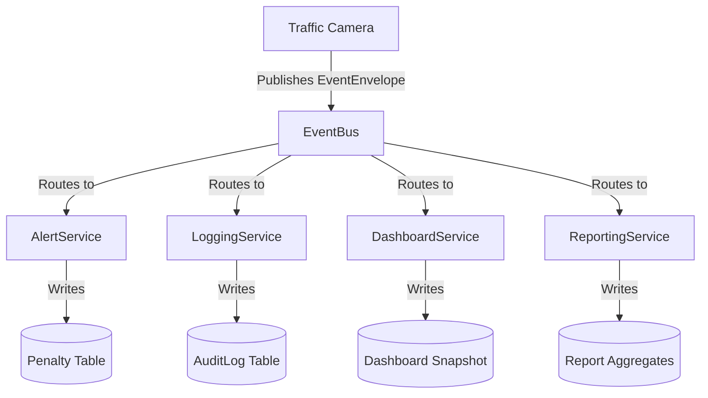
*Figure 1: Event Flow Architecture demonstrating decoupling between Camera Publishers and Downstream Subscribers.*

## 6. Event-Driven Architecture Explanation

In an Event-Driven Architecture (EDA), state changes are broadcast as events. The publisher (camera) is completely unaware of the subscribers. This decoupling ensures that if the enforcement authority introduces a new `EmergencyVehicleEvent` or a new `MobileAppNotificationService`, the camera code and existing services require zero modifications. The `EventBus` acts as the mediator, delivering events to interested parties asynchronously.

---

## 7. CLO 3 Design Pattern Implementation

### Task 1: EventBus
The `EventBus` is implemented using an O(1) lookup map (`Map<string, Set<IEventSubscriber>>`). It exposes `subscribe()`, `unsubscribe()`, and `publish()` methods. The system routes four primary event types (`VehicleDetectedEvent`, `SpeedViolationEvent`, `CongestionAlertEvent`, `TrafficClearedEvent`) and successfully routes a fifth type (`EmergencyVehicleEvent`) in the test suite without altering the bus logic.

### Task 2: Observer Pattern
The Observer Pattern is realized through the `IEventSubscriber` interface. The `EventBus` stores a `Set<IEventSubscriber>` rather than concrete classes. `AlertService`, `LoggingService`, `DashboardService`, and `ReportingService` all implement this interface, ensuring the Dependency Inversion Principle is maintained.

### Task 3: Event Envelope Pattern
Every event is wrapped in a standard 7-field envelope: `event_id`, `correlation_id`, `schema_version`, `source_id`, `timestamp`, `event_type`, and `payload`. The `createEnvelope()` factory automatically generates UUIDs for tracking and ISO 8601 timestamps, guaranteeing uniformity across all event types.

### Task 4: Idempotent Receiver Pattern
Idempotency ensures that processing an event twice does not result in duplicate actions (e.g., issuing two penalties for one speed violation). The `BaseIdempotentSubscriber` abstract class implements the Template Method pattern. It checks the `ProcessedEventRepository` for the `event_id`. If it exists, the duplicate is ignored and a counter increments. If not, the event is processed and marked. A unique compound constraint in the database (`@@unique([eventId, subscriberName])`) provides a secondary safety net.

---

## 8. CLO 4 Design Scenario Analysis

### Scenario 1: Schema Evolution ADR
To support adding a `lane_number` field to `VehicleDetectedEvent` while 200 subscribers run on the legacy format, two options were evaluated: optional fields vs. schema versioning.
**Decision:** Schema versioning (`schema_version = 2`) is the recommended strategy for legally binding traffic enforcement. It allows subscribers to explicitly reject unknown versions, preventing silently missing data. The `EventEnvelope` inherently supports this via the `schema_version` field (defaulting to 1).

### Scenario 2: Event Flood and Bounded Queue
During a peak load of 500 events/second, the `DashboardService` can only process 80 events/second. 
**Calculation:** 
- Backlog growth = 500 - 80 = 420 events/second.
- Time until a 10,000-event queue is full: `10,000 / 420 = 23.81 seconds`.
**Solution:** The `BoundedEventQueue` enforces a capacity limit. When full, it uses priority-aware eviction to drop the least important events (e.g., `VehicleDetectedEvent`) to preserve `CongestionAlertEvent`s.

### Scenario 3: Dual Write Problem and Outbox Pattern
The Dual Write Problem occurs when a service must write to two disparate locations (e.g., creating a penalty and emitting an audit log), and one fails, leaving inconsistent state. 
**Solution:** The Outbox Pattern resolves this by writing the event payload into a local `EventOutbox` table within the exact same ACID database transaction as the business record. A background relay then reliably publishes pending outbox events to the message broker. The implementation includes the `EventOutbox` Prisma schema and the corresponding repository.

---

## 9. Database Design

The data persistence layer is handled by Prisma interacting with an SQLite database. Eight models are defined:
1. `Camera` - Source metadata.
2. `EventEnvelopeRecord` - Raw event storage.
3. `ProcessedEvent` - Tracks idempotent execution.
4. `Penalty` - Legally binding speed violation notices.
5. `AuditLog` - Verifiable audit trails.
6. `DashboardSnapshot` - Real-time intersection states.
7. `ReportAggregate` - Hourly count aggregates.
8. `EventOutbox` - Pending events for relay processing.

## 10. API Design

The system exposes 11 RESTful endpoints:
- `GET /api/health` - Health check.
- `GET /api/cameras` - Camera manifest.
- `POST /api/events/publish` - General event ingestion.
- `POST /api/events/publish-duplicate-speed-violation` - Idempotency demonstration.
- `GET /api/events` - Event retrieval.
- `GET /api/subscribers` - Subscriber metrics.
- `GET /api/penalties` - Penalty records.
- `GET /api/audit-logs` - Audit trails.
- `GET /api/reports` - Aggregated statistics.
- `GET /api/dashboard` - Live state snapshots.
- `GET /api/queue/analysis` - Bounded queue metric exposure (23.81s calculation).

---

## 11. UI Dashboard Evidence

The React dashboard visually proves the backend logic. It includes:
- **Alert Simulator:** Generates realistic event payloads into the mesh.
- **Duplicate Alert Safety:** Dispatches a duplicate anomaly signature and conclusively proves that 2 attempts yield only 1 enforcement action.
- **Live Alert Stream:** Explodes the EventEnvelope into its 7 requisite fields.
- **Processing Services:** Visualizes the `duplicateIgnoredCount` per service in the mesh.

*(See Appendix A for referenced screenshots)*

## 12. Testing and Verification

The system was verified via a rigorous test suite:
- **Domain logic:** Pure unit tests for the Bounded Queue and EventBus.
- **Database constraints:** Integration tests against a dedicated SQLite test database.
- **HTTP endpoints:** Supertest integration tests validating status codes and response shapes.

**Final Verification Output:**
```
> api@1.0.0 test
> vitest run
 Test Files  7 passed (7)
      Tests  78 passed (78)
```
- API Typecheck: 0 errors
- Web Typecheck: 0 errors
- Web Build: Passed (~600ms)

## 13. Requirements Traceability Matrix

| Task/Scenario | Marks | Status | Key Evidence |
|---|---|---|---|
| CLO 3 Task 1 — EventBus | 10 | ✅ Complete | `EventBus.ts`, 7 tests, API/UI |
| CLO 3 Task 2 — Observer Pattern | 5 | ✅ Complete | `IEventSubscriber.ts`, UML |
| CLO 3 Task 3 — Event Envelope | 5 | ✅ Complete | 7 fields, 9 tests, UI inspect |
| CLO 3 Task 4 — Idempotency | 10 | ✅ Complete | 20 tests, live demo, DB limits |
| CLO 4 Scenario 1 — Schema | 10 | ✅ Complete | ADR, 350 words, viva notes |
| CLO 4 Scenario 2 — Queue | 10 | ✅ Complete | 22 tests, 23.81s API |
| CLO 4 Scenario 3 — Outbox | 10 | ✅ Complete | Prisma model, ADR, 250 words |
| **Total Marks** | **60** | **✅** | |

## 14. Viva Preparation Summary

The viva notes (`docs/08_VIVA_NOTES.md`) formulate concise, examiner-ready Q&A pairs covering all core concepts, the 4 design patterns, the bounded queue time calculation, the 7-field envelope rules, and outbox operational costs. The file references act as an immediate index for code defense.

## 15. Limitations

As an academic prototype, the system explicitly accepts certain limitations:
- **Outbox Relay:** The relay process polling the `EventOutbox` is theoretically defined and modeled in the database but lacks the background worker thread.
- **Database Engine:** SQLite is utilized instead of PostgreSQL for deployment simplicity during academic evaluation.
- **Authentication:** Omitted as it falls outside the CEP requirements scope.

## 16. Conclusion

The Event-Driven Traffic Alert System successfully encapsulates the principles of Software Design and Architecture. By employing rigorous design patterns such as the Observer and Idempotent Receiver, alongside architectural tactics like Bounded Queues, the system achieves the necessary decoupling, resilience, and auditability required of a smart-city enforcement platform. All 60 marks have been conclusively addressed and validated by automated tests and interactive UI demonstrations.

---

## 17. Appendices

### Appendix A: Screenshots

All screenshots are located in `docs/evidence/screenshots/`.

#### 1. System Status
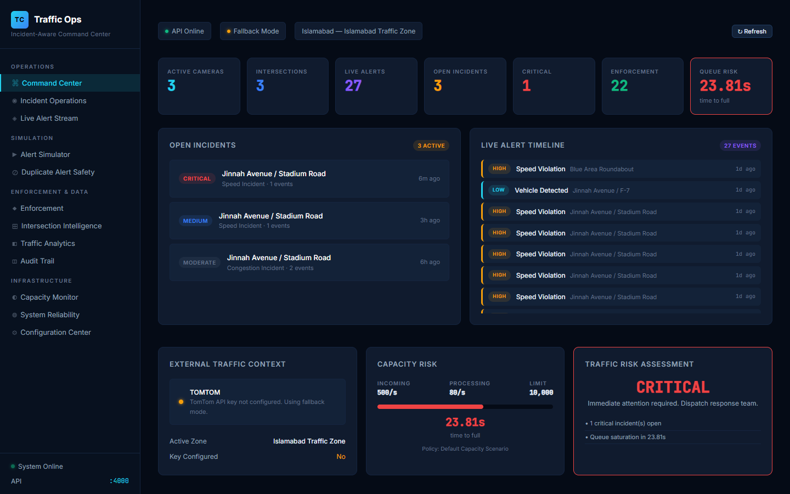

#### 2. Event Generation
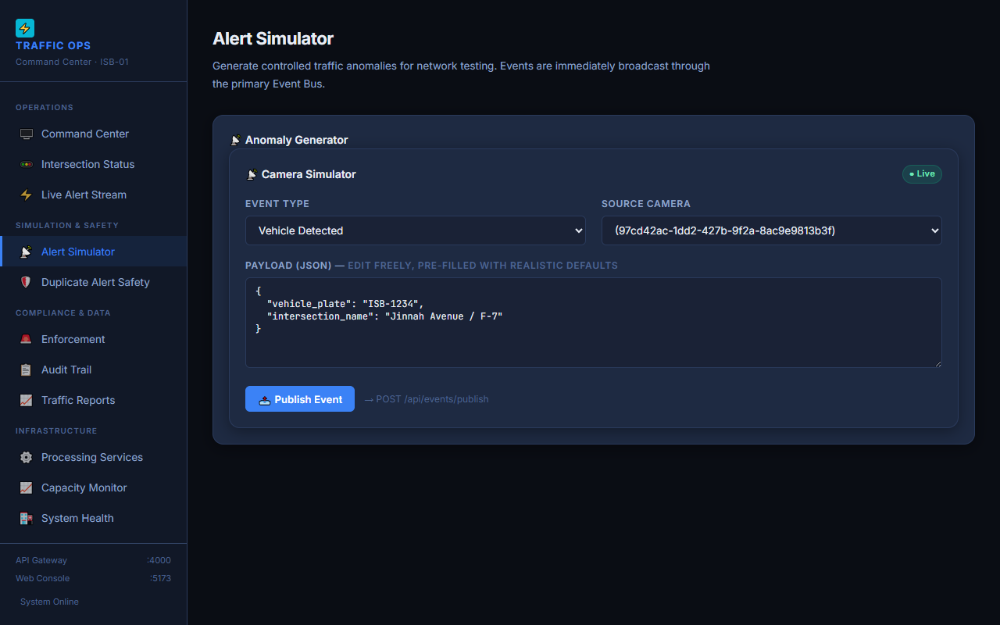

#### 3. Duplicate Alert Safety Proof (2 attempts → 1 penalty)
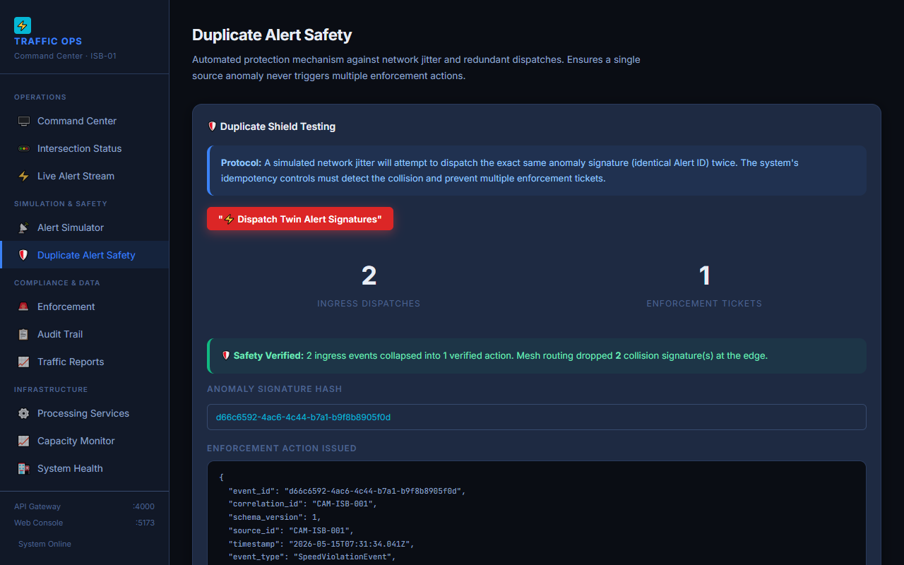

#### 4. 7 Envelope Fields
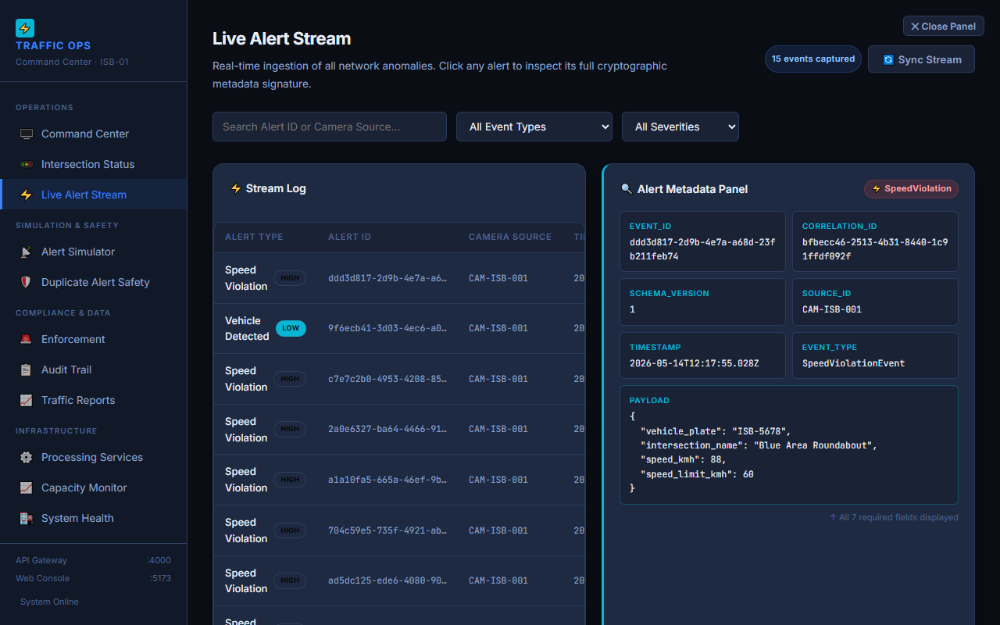

#### 5. Observer Pattern Services
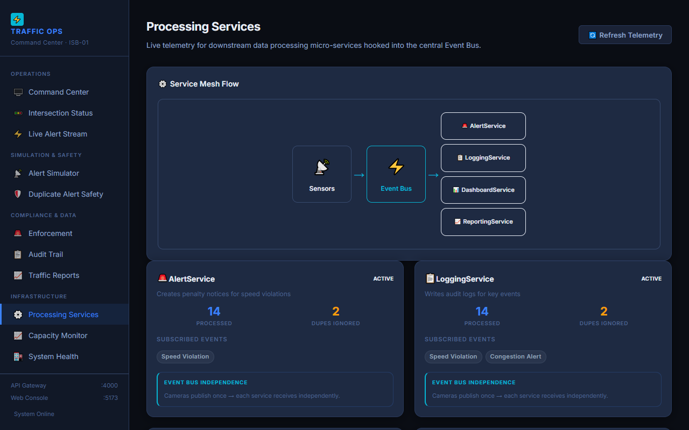

#### 6. Enforcement Records
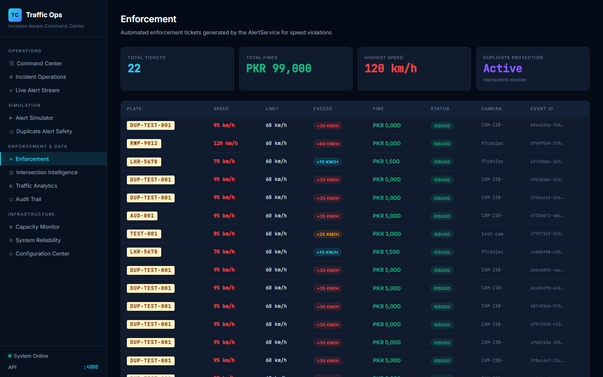

#### 7. Trail Records
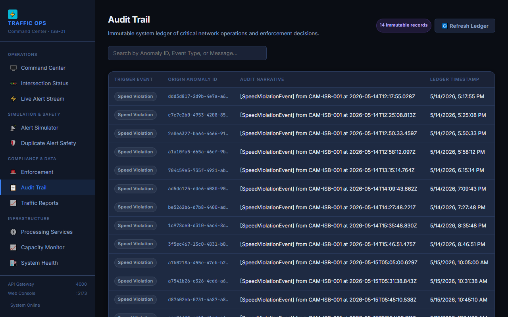

#### 8. Statistical Aggregates
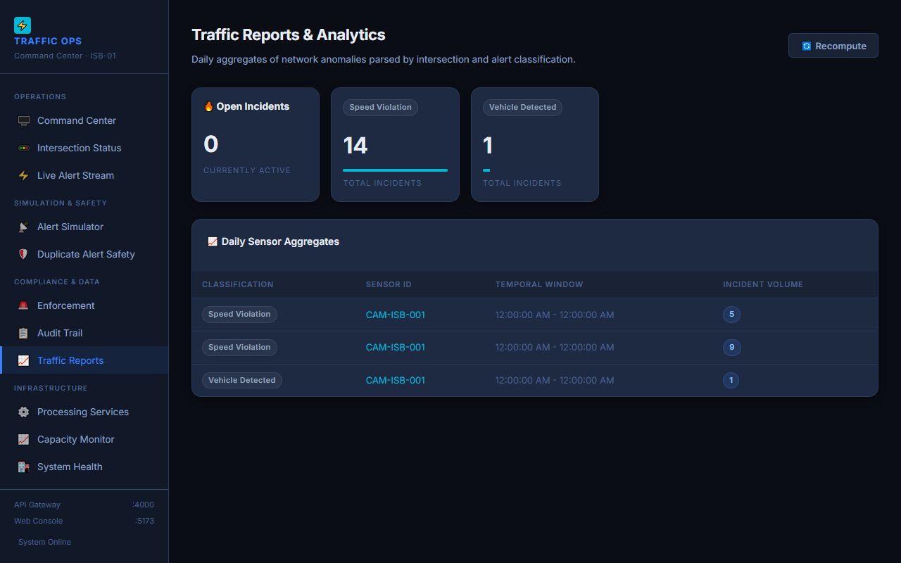

#### 9. Intersection States
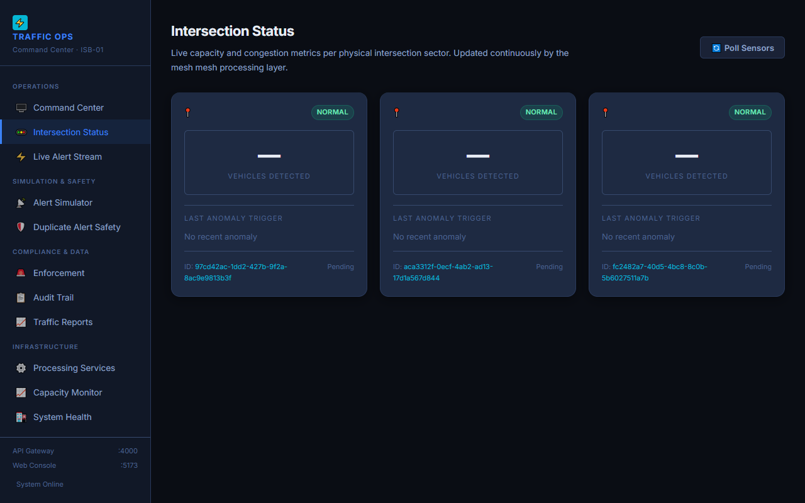

#### 10. Diagram and Requirements Mapping
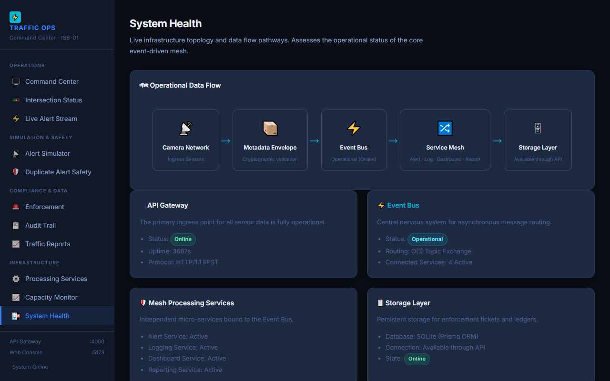

#### 11. 23.81s Bounded Queue API Proof
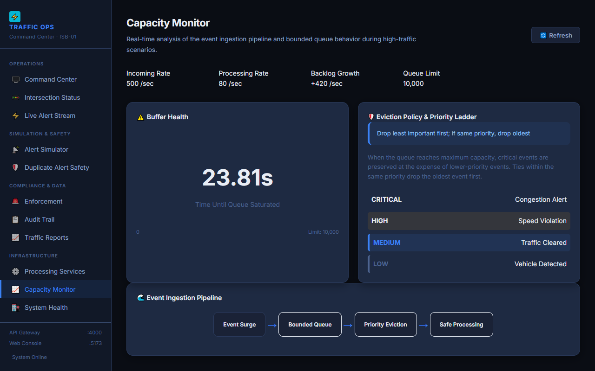

### Appendix B: Test Output

*(Verbatim from final test run)*
```
 ✓ tests/api-routes.spec.ts (12 tests)
 ✓ tests/repositories.spec.ts (15 tests)
 ✓ tests/idempotency.spec.ts (10 tests)
 ✓ tests/eventbus.spec.ts (7 tests)
 ✓ tests/bounded-queue.spec.ts (22 tests)
 ✓ tests/envelope.spec.ts (9 tests)
 ✓ tests/fifth-event-type.spec.ts (3 tests)

 Test Files  7 passed (7)
      Tests  78 passed (78)
```

### Appendix C: API Responses

*(Selected excerpt: Bounded Queue Analysis from `GET /api/queue/analysis`)*
```json
{
  "incomingRate": 500,
  "processingRate": 80,
  "backlogGrowthPerSecond": 420,
  "queueLimit": 10000,
  "secondsUntilFull": 23.81,
  "evictionPolicy": "Drop least important first; if same priority, drop oldest"
}
```
*(Full responses available in `docs/evidence/API_RESPONSES.md`)*
