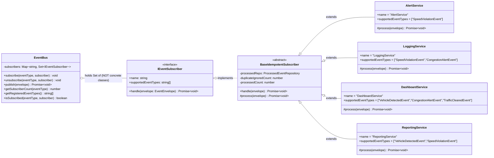

# UML 1 — Observer Pattern Class Diagram

> **Required by CEP rubric — CLO 3 Task 2 (5 marks)**
> Shows `IEventSubscriber`, `EventBus`, and all 4 subscriber classes with correctly labelled arrows.

---

## Diagram

---

## What to Point At in Viva

1. **The interface at top** — `IEventSubscriber` is what every subscriber must implement.
2. **The arrow from EventBus to IEventSubscriber** — labelled "holds Set of". This is the heart of the Observer Pattern: the bus only knows the interface.
3. **No arrow from EventBus to any concrete class** — that's the proof of decoupling.
4. **All 4 subscribers extend `BaseIdempotentSubscriber`** — they get duplicate protection for free (CLO 3 Task 4).
5. **5th subscriber rule:** adding `EmergencyService` would mean drawing one more class extending `BaseIdempotentSubscriber`. **Zero changes to `EventBus`.**

---

## Source Files

- Interface: [apps/api/src/domain/subscribers/IEventSubscriber.ts](../../apps/api/src/domain/subscribers/IEventSubscriber.ts)
- Base class: [apps/api/src/domain/subscribers/BaseIdempotentSubscriber.ts](../../apps/api/src/domain/subscribers/BaseIdempotentSubscriber.ts)
- Bus: [apps/api/src/domain/bus/EventBus.ts](../../apps/api/src/domain/bus/EventBus.ts) (line 20: `private subscribers = new Map<string, Set<IEventSubscriber>>()`)
- Subscribers: [apps/api/src/domain/subscribers/](../../apps/api/src/domain/subscribers/)
