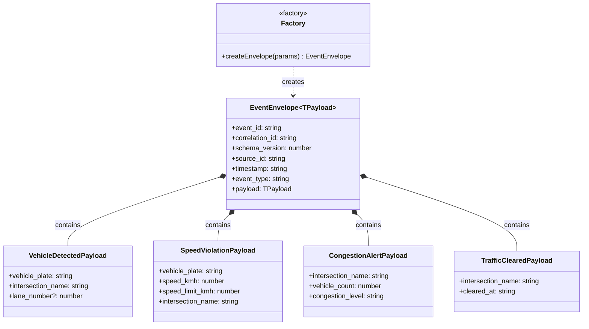

# Figure 2: Event Envelope Pattern Class Diagram

> **Requirement covered:** CLO 3 Task 3 — Event Envelope Pattern
> **Code evidence:** `EventEnvelope.ts`, `EventTypes.ts`, `createEnvelope.ts`

---

## Diagram

