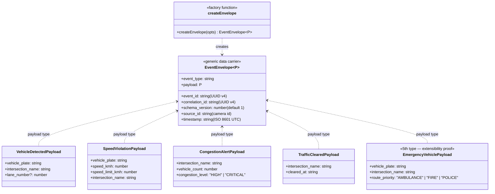

# UML 2 — Event Envelope Class Diagram

> **Supports CEP rubric — CLO 3 Task 3 (5 marks)**
> Visualizes the 7 envelope fields and how each event type's payload plugs into the generic `EventEnvelope
`.

---

## Diagram

---

## What to Point At in Viva

1. **Exactly 7 fields** in the envelope — match the CEP table one-for-one.
2. **`schema_version`** — already there, defaults to 1. Used by CLO 4 Scenario 1 (schema evolution).
3. **Generic `
`** — the envelope shape is the same for every event type; only payload differs. This is what makes the bus type-agnostic.
4. **Priority is NOT a field** — priority is derived externally by `BoundedEventQueue` from `event_type`. Envelope stays a pure 7-field data carrier (defensible design choice).
5. **`createEnvelope()` factory** auto-generates `event_id` (UUID v4) and `timestamp` (ISO 8601), so cameras can't forget them.

---

## Source Files

- Envelope type: [apps/api/src/domain/events/EventEnvelope.ts](../../apps/api/src/domain/events/EventEnvelope.ts)
- Factory: [apps/api/src/domain/events/createEnvelope.ts](../../apps/api/src/domain/events/createEnvelope.ts)
- Payload types: [apps/api/src/domain/events/EventTypes.ts](../../apps/api/src/domain/events/EventTypes.ts)
- Tests: [apps/api/tests/envelope.spec.ts](../../apps/api/tests/envelope.spec.ts) (9 tests — one per field + factory behavior)
