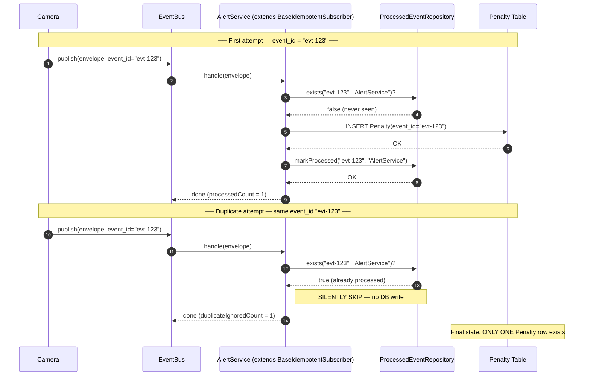

# UML 3 — Idempotent Receiver Sequence Diagram

> **Supports CEP rubric — CLO 3 Task 4 (10 marks)**
> Shows what happens when the SAME `SpeedViolationEvent` (same `event_id`) is published twice. AlertService must create only ONE penalty.

---

## Diagram

---

## What to Point At in Viva

1. **Steps 3-4 (first attempt):** repo says "never seen" → process runs → penalty inserted.
2. **Step 7 (first attempt):** `markProcessed` records `(event_id, subscriber_name)`. **Per-subscriber tracking** — AlertService and LoggingService each have their own log.
3. **Step 11 (duplicate):** repo says "already processed" → handle returns early. **`process()` is never called the second time.**
4. **Final state box:** ONE penalty in DB. This is exactly what the CEP rubric asks the test to prove.
5. **Double safety net:** Even if the in-memory check fails, the DB unique constraint `Penalty @unique(eventId)` blocks the second insert.

---

## Source Files

- Template Method: [apps/api/src/domain/subscribers/BaseIdempotentSubscriber.ts](../../apps/api/src/domain/subscribers/BaseIdempotentSubscriber.ts) (lines 50-64)
- AlertService: [apps/api/src/domain/subscribers/AlertService.ts](../../apps/api/src/domain/subscribers/AlertService.ts)
- Test proving it: [apps/api/tests/idempotency.spec.ts](../../apps/api/tests/idempotency.spec.ts) (10 tests)
- Live demo endpoint: `POST /api/events/publish-duplicate-speed-violation` → returns `{ published_attempts: 2, penalties_created: 1, duplicate_ignored_by_alert: 1 }`
- UI demo: Dashboard → "Idempotency Demo" red button (screenshot `04-duplicate-alert-safety.png`)
