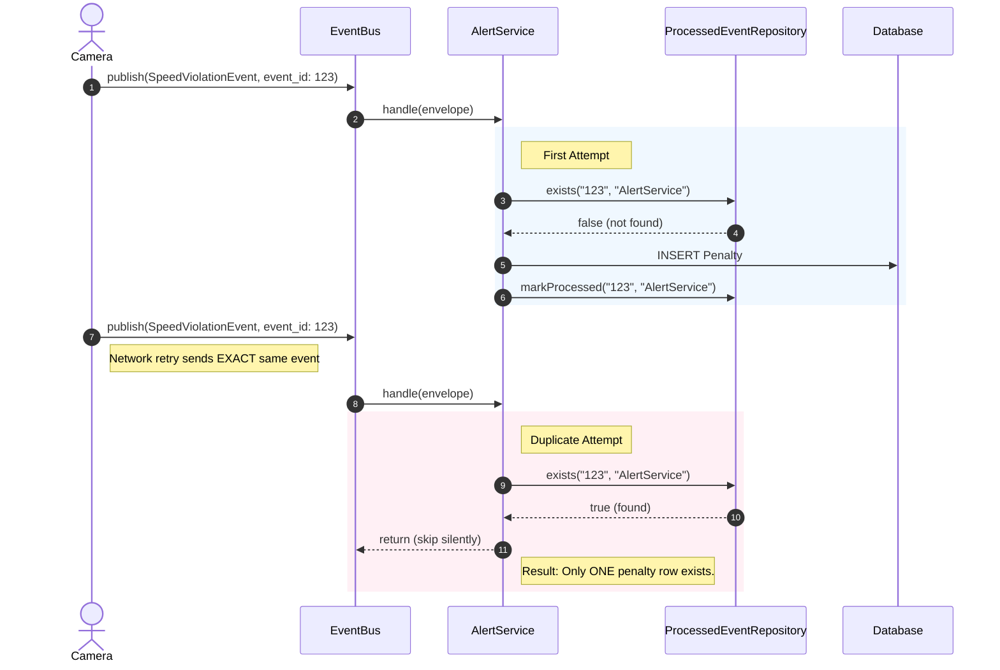

# Figure 3: Idempotent Receiver Sequence Diagram

> **Requirement covered:** CLO 3 Task 4 — Idempotent Receiver Pattern
> **Code evidence:** `BaseIdempotentSubscriber.ts`, `ProcessedEventRepository.ts`

---

## Diagram

