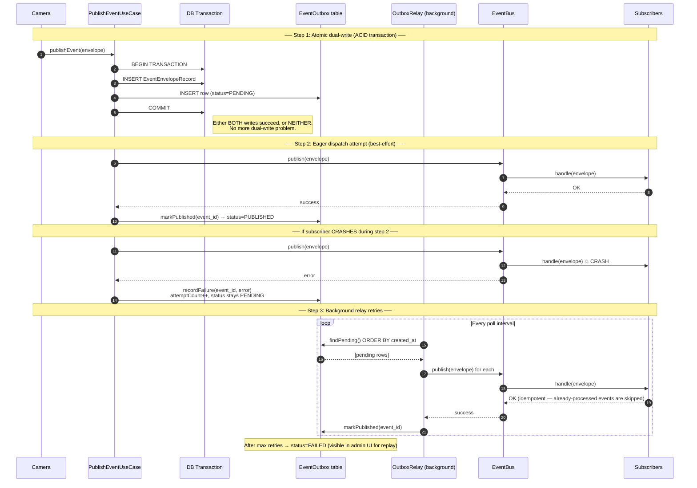

# UML 4 — Outbox Pattern Sequence Diagram

> **Supports CEP rubric — CLO 4 Scenario 3 (10 marks)**
> Shows how the Outbox Pattern fixes the **Dual Write Problem**: the event is written to a local DB inside the same transaction, then a background relay publishes it to the bus.

---

## Diagram

---

## What to Point At in Viva

1. **Step 1 (transaction box):** The business record AND the outbox row are written **inside the same DB transaction**. This is the atomic guarantee that kills the Dual Write Problem.
2. **Step 2 (eager dispatch):** Optimistic publish — keeps latency low when everything is healthy.
3. **Crash branch:** If a subscriber crashes, the outbox row **stays PENDING** with an incremented `attemptCount`. Nothing is lost.
4. **Step 3 (relay):** Background process retries every PENDING row until it succeeds. This is what makes delivery **guaranteed**.
5. **Idempotency synergy:** The relay's retry is safe because subscribers already use the Idempotent Receiver Pattern (CLO 3 Task 4). Same `event_id` published twice → still only one penalty.
6. **FAILED state:** After `maxAttempts`, the row flips to terminal FAILED. Visible in the admin UI for manual replay.

---

## Source Files

- Repository: [apps/api/src/infrastructure/repositories/OutboxRepository.ts](../../apps/api/src/infrastructure/repositories/OutboxRepository.ts)
- DB schema: [prisma/schema.prisma](../../prisma/schema.prisma) → `EventOutbox` model
- Test: [apps/api/tests/outbox-pattern.spec.ts](../../apps/api/tests/outbox-pattern.spec.ts) — proves atomic dual-write + retry on crash
- Written analysis: [docs/07_CLO4_ANALYSIS_ADR.md](../07_CLO4_ANALYSIS_ADR.md) → Scenario 3
