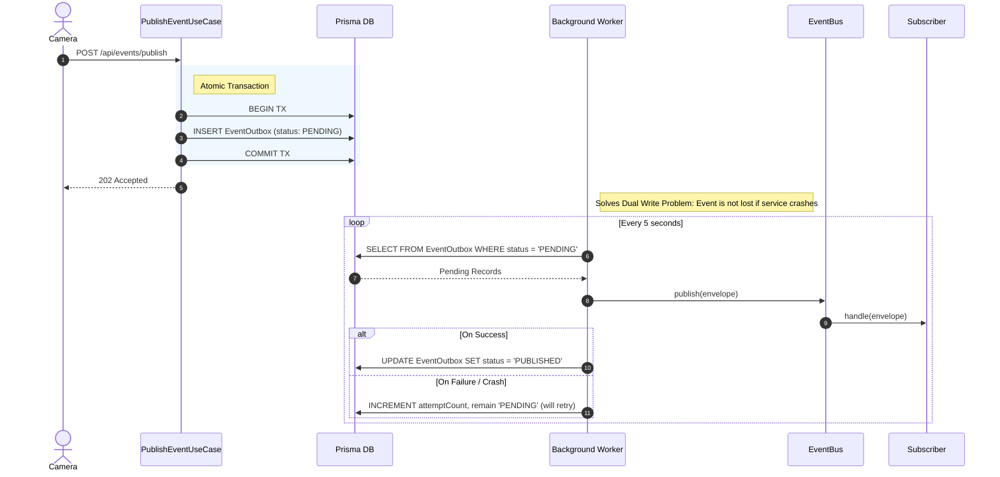

# Figure 4: Outbox Pattern Sequence Diagram

> **Requirement covered:** CLO 4 Scenario 3 — Dual Write Problem / Outbox Pattern
> **Code evidence:** `PublishEventUseCase.ts`, `OutboxRelay.ts`, `OutboxRepository.ts`

---

## Diagram

