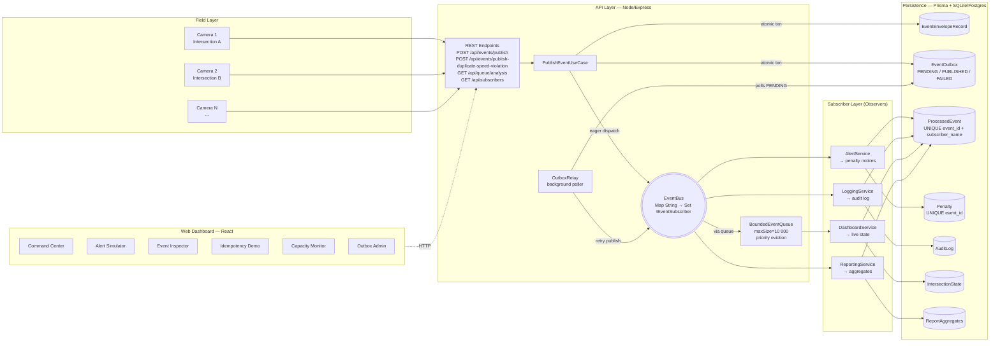

# UML 5 — System Component / Deployment View

> **System overview** — shows the full deployed architecture: cameras, API, EventBus, subscribers, database, and the web dashboard.

---

## Diagram

---

## What to Point At in Viva

1. **Three horizontal layers:** Field (cameras), API (logic + bus), Subscribers (4 observers). Database sits behind everything.
2. **Cameras only know REST endpoint** — they don't know AlertService, LoggingService, etc. exist.
3. **EventBus in the middle** — single point of fan-out. Adding a 5th subscriber = adding one more arrow out of `Bus`.
4. **Outbox path** — `UC → atomic txn → OutboxDB` then `Relay → Bus`. This is the dual-write fix.
5. **BoundedEventQueue between Bus and DashboardService** — protects the slow consumer (80 events/sec) from the fast producer (500 events/sec).
6. **ProcessedEvent table is shared** — every subscriber writes to it; idempotency check is per `(event_id, subscriber_name)` pair.

---

## Source Files / Mapping

| Component in diagram | Code location |
|---|---|
| REST endpoints | [apps/api/src/interfaces/http/routes/](../../apps/api/src/interfaces/http/routes/) |
| PublishEventUseCase | [apps/api/src/application/usecases/PublishEventUseCase.ts](../../apps/api/src/application/usecases/PublishEventUseCase.ts) |
| EventBus | [apps/api/src/domain/bus/EventBus.ts](../../apps/api/src/domain/bus/EventBus.ts) |
| BoundedEventQueue | [apps/api/src/domain/bus/BoundedEventQueue.ts](../../apps/api/src/domain/bus/BoundedEventQueue.ts) |
| Subscribers | [apps/api/src/domain/subscribers/](../../apps/api/src/domain/subscribers/) |
| Outbox repo | [apps/api/src/infrastructure/repositories/OutboxRepository.ts](../../apps/api/src/infrastructure/repositories/OutboxRepository.ts) |
| Prisma schema | [prisma/schema.prisma](../../prisma/schema.prisma) |
| Web UI | [apps/web/src/](../../apps/web/src/) |
