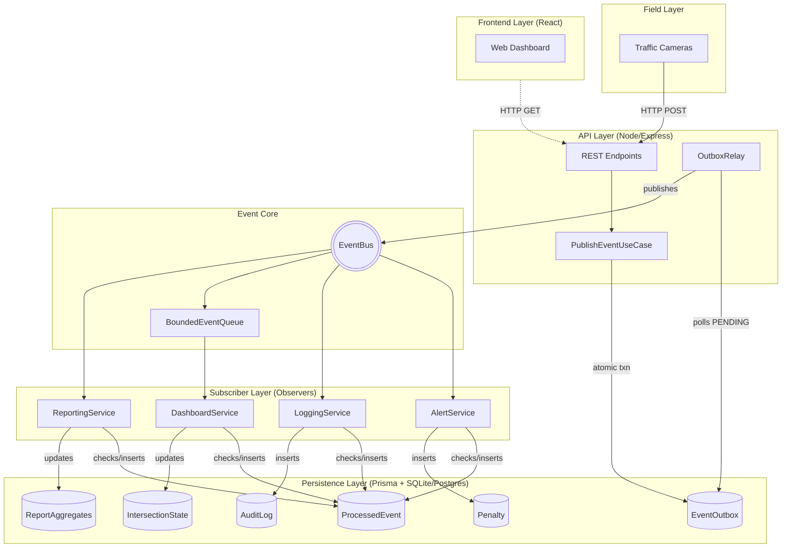

# Figure 5: System Component / Deployment Diagram

> **Requirement covered:** High-level architecture overview
> **Code evidence:** Monorepo architecture (`apps/api`, `apps/web`), Prisma schema, EventBus layout

---

## Diagram

