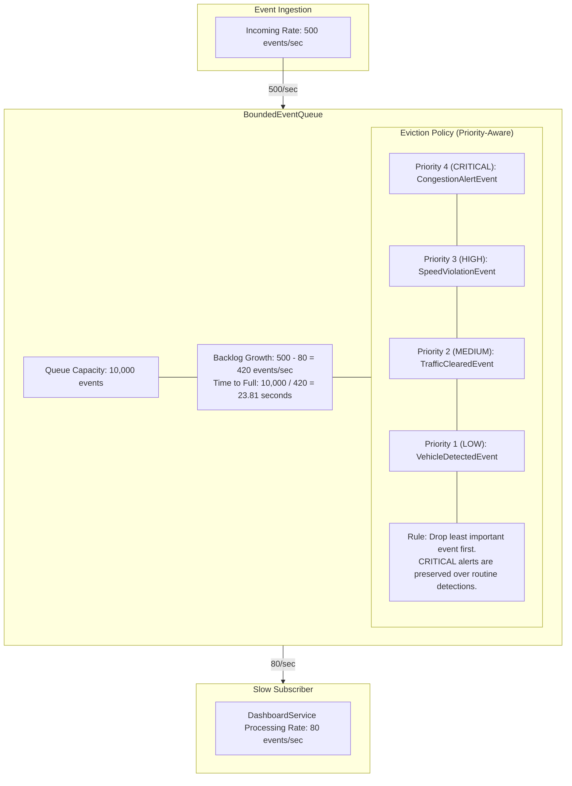

# Figure 6: Bounded Queue / Event Flood Scenario

> **Requirement covered:** CLO 4 Scenario 2 — Event Flood / Bounded Queue Eviction
> **Code evidence:** `BoundedEventQueue.ts` (`calculateSecondsUntilFull`, `EVENT_PRIORITY`)

---

## Diagram

